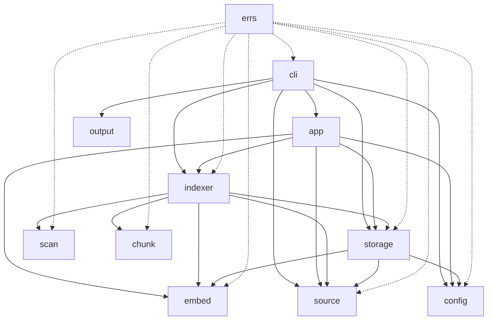

# Stage 1 Implementation Specification - Go

## Overview

This document defines the Go implementation specification for Stage 1 of the [`sem`](docs/final-plan.md) project: a local-first semantic search CLI with LanceDB as the default runtime backend and a portable local bundle as the source of truth.

This specification stays closely aligned with [`docs/stage1-spec.md`](docs/stage1-spec.md) so the migration from the Rust-oriented draft is easy to compare, but the implementation guidance here is fully Go-native.

**Stage 1 Scope:**
- Config system
- Source registry
- File scanning
- Ignore rules
- Basic chunking
- Local embeddings
- LanceDB adapter
- [`sem index`](docs/stage1-spec-go.md)
- [`sem search`](docs/stage1-spec-go.md)
- [`--json`](docs/stage1-spec-go.md) output flag

---

## 1. Project Structure

### 1.1 Repository Layout

```text
sem/
├── go.mod
├── go.sum
├── .gitignore
├── README.md
├── LICENSE
├── Makefile
├── docs/
│   ├── final-plan.md
│   ├── initial-plan.md
│   ├── stage1-spec.md
│   └── stage1-spec-go.md
├── cmd/
│   └── sem/
│       └── main.go                 # binary entry point
├── internal/
│   ├── app/
│   │   ├── app.go                  # dependency wiring
│   │   └── paths.go                # ~/.sem path resolution
│   ├── cli/
│   │   ├── root.go                 # root Cobra command
│   │   ├── init.go                 # sem init
│   │   ├── index.go                # sem index
│   │   ├── search.go               # sem search
│   │   └── source.go               # sem source subtree
│   ├── config/
│   │   ├── config.go               # config structs and defaults
│   │   ├── loader.go               # Viper load/save helpers
│   │   └── validate.go             # config validation
│   ├── source/
│   │   ├── registry.go             # source CRUD
│   │   └── types.go                # source structs
│   ├── scan/
│   │   ├── walker.go               # directory walking
│   │   ├── ignore.go               # ignore matcher
│   │   └── reader.go               # file loading helpers
│   ├── chunk/
│   │   ├── chunker.go              # chunking interfaces
│   │   ├── text.go                 # text and markdown chunking
│   │   └── code.go                 # code-oriented chunking
│   ├── embed/
│   │   ├── model.go                # embedding model catalog
│   │   ├── runtime.go              # ONNX runtime bridge
│   │   ├── tokenizer.go            # tokenizer loading
│   │   └── service.go              # embedding orchestration
│   ├── storage/
│   │   ├── bundle.go               # manifest and parquet bundle I O
│   │   ├── parquet.go              # Arrow and Parquet schemas
│   │   ├── lancedb.go              # LanceDB adapter
│   │   └── search.go               # storage-backed semantic lookup
│   ├── indexer/
│   │   ├── indexer.go              # scan to chunk to embed to store pipeline
│   │   └── pipeline.go             # worker coordination
│   ├── output/
│   │   ├── human.go                # terminal rendering
│   │   └── json.go                 # JSON encoding
│   └── errs/
│       ├── kinds.go                # typed errors
│       └── format.go               # user-facing formatting
├── pkg/
│   └── semver/
│       └── version.go              # public version helpers if later needed
└── testdata/
    ├── config/
    ├── fixtures/
    └── models/
```

### 1.2 Runtime Storage Layout

```text
~/.sem/
├── config.toml
├── bundles/
│   └── default/
│       ├── manifest.json
│       ├── chunks.parquet
│       ├── embeddings.parquet
│       └── model.json
└── backends/
    └── lancedb/
```

### 1.3 Go Layout Rationale

- [`cmd/sem/main.go`](cmd/sem/main.go) contains only process startup, version wiring, and error exit handling.
- [`internal/`](internal/) holds the MVP implementation that should not be imported by external consumers.
- [`pkg/`](pkg/) remains intentionally small in Stage 1. If no public reusable API emerges, it can stay nearly empty.
- The Stage 1 binary is CLI-first, so package boundaries should optimize maintainability, testability, and minimal coupling rather than framework abstraction.

---

## 2. Package Layout

### 2.1 Dependency Shape



### 2.2 Package Responsibilities

| Package | Responsibility |
|---|---|
| `cmd/sem` | Program entry point and process exit behavior |
| `internal/app` | Construct application services from config and runtime paths |
| `internal/cli` | Cobra command tree and command handlers |
| `internal/config` | Config schema, defaults, validation, load, persist |
| `internal/source` | Source registration and lookup |
| `internal/scan` | Recursive file discovery, ignore evaluation, file reads |
| `internal/chunk` | Chunking strategies and metadata extraction |
| `internal/embed` | Embedding modes, model metadata, ONNX inference |
| `internal/storage` | Bundle persistence, Arrow and Parquet schema, LanceDB adapter |
| `internal/indexer` | End-to-end indexing orchestration |
| `internal/output` | Human-readable and JSON output formatting |
| `internal/errs` | Typed sentinel and wrapped errors |

### 2.3 Package Design Rules

1. Keep structs local to the package unless they are part of cross-package contracts.
2. Prefer small interfaces defined at the consumer side rather than provider side.
3. Use constructors like [`config.NewDefault()`](docs/stage1-spec-go.md:1), [`source.NewRegistry()`](docs/stage1-spec-go.md:1), and [`indexer.New()`](docs/stage1-spec-go.md:1) to guarantee invariants.
4. Avoid global state other than process-level Cobra initialization.
5. Keep Viper usage isolated to [`internal/config/loader.go`](internal/config/loader.go); the rest of the code should depend on plain Go structs.

### 2.4 Suggested Core Interfaces

```go
package indexer

type Scanner interface {
    Scan(ctx context.Context, src source.Definition) ([]scan.FileCandidate, error)
}

type Chunker interface {
    Chunk(ctx context.Context, file scan.FileDocument) ([]chunk.Record, error)
}

type Embedder interface {
    Model() embed.ModelSpec
    Embed(ctx context.Context, texts []string) ([][]float32, error)
}

type BundleStore interface {
    WriteBundle(ctx context.Context, bundle storage.BundleWrite) error
}

type VectorStore interface {
    RebuildIndex(ctx context.Context, records []storage.VectorRecord) error
    Search(ctx context.Context, query []float32, limit int) ([]storage.SearchHit, error)
}
```

---

## 3. Config Schema

### 3.1 Canonical [`config.toml`](docs/stage1-spec-go.md)

```toml
# ~/.sem/config.toml

[general]
default_bundle = "default"
embedding_mode = "balanced"

[embedding]
mode = "balanced"
model_cache_dir = "/Users/you/.sem/models"
batch_size = 32
max_tokens = 512
normalize = true

[storage]
bundle_dir = "/Users/you/.sem/bundles"
backend = "lancedb"

[storage.lancedb]
path = "/Users/you/.sem/backends/lancedb"
table = "chunks"
metric = "cosine"

[chunking]
max_chars = 2200
overlap_chars = 300
min_chars = 400
respect_headings = true

[ignore]
default_patterns = [
  ".git",
  "node_modules",
  "target",
  "dist",
  "build",
  "vendor",
  "__pycache__",
  ".idea",
  ".vscode",
  ".obsidian",
  "*.min.js",
  "*.min.css"
]

[[sources]]
name = "vault"
path = "/Users/you/vault"
enabled = true
include_extensions = ["md", "txt"]
exclude_patterns = []

[[sources]]
name = "repos"
path = "/Users/you/code"
enabled = true
include_extensions = ["go", "rs", "ts", "js", "py", "md"]
exclude_patterns = ["vendor/**", "dist/**"]
```

### 3.2 Viper Binding Strategy

Use Viper only for:
- locating [`~/.sem/config.toml`](docs/stage1-spec-go.md)
- reading TOML into a Go struct
- writing the updated config file back to disk
- optional environment overrides later

Do not spread Viper throughout the codebase. The application should operate on a single [`config.Config`](docs/stage1-spec-go.md:1) struct after load.

Recommended setup:

```go
v := viper.New()
v.SetConfigFile(configPath)
v.SetConfigType("toml")
v.SetEnvPrefix("SEM")
v.SetEnvKeyReplacer(strings.NewReplacer(".", "_"))
v.AutomaticEnv()
```

Stage 1 should not rely heavily on environment-variable configuration, but the loader should be compatible with it.

### 3.3 Go Config Structs

```go
package config

type Config struct {
    General  GeneralConfig   `mapstructure:"general" toml:"general"`
    Embedding EmbeddingConfig `mapstructure:"embedding" toml:"embedding"`
    Storage  StorageConfig   `mapstructure:"storage" toml:"storage"`
    Chunking ChunkingConfig  `mapstructure:"chunking" toml:"chunking"`
    Ignore   IgnoreConfig    `mapstructure:"ignore" toml:"ignore"`
    Sources  []SourceConfig  `mapstructure:"sources" toml:"sources"`
}

type GeneralConfig struct {
    DefaultBundle string        `mapstructure:"default_bundle" toml:"default_bundle"`
    EmbeddingMode EmbeddingMode `mapstructure:"embedding_mode" toml:"embedding_mode"`
}

type EmbeddingConfig struct {
    Mode          EmbeddingMode `mapstructure:"mode" toml:"mode"`
    ModelCacheDir string        `mapstructure:"model_cache_dir" toml:"model_cache_dir"`
    BatchSize     int           `mapstructure:"batch_size" toml:"batch_size"`
    MaxTokens     int           `mapstructure:"max_tokens" toml:"max_tokens"`
    Normalize     bool          `mapstructure:"normalize" toml:"normalize"`
}

type StorageConfig struct {
    BundleDir string               `mapstructure:"bundle_dir" toml:"bundle_dir"`
    Backend   string               `mapstructure:"backend" toml:"backend"`
    LanceDB   LanceDBStorageConfig `mapstructure:"lancedb" toml:"lancedb"`
}

type LanceDBStorageConfig struct {
    Path   string `mapstructure:"path" toml:"path"`
    Table  string `mapstructure:"table" toml:"table"`
    Metric string `mapstructure:"metric" toml:"metric"`
}

type ChunkingConfig struct {
    MaxChars        int  `mapstructure:"max_chars" toml:"max_chars"`
    OverlapChars    int  `mapstructure:"overlap_chars" toml:"overlap_chars"`
    MinChars        int  `mapstructure:"min_chars" toml:"min_chars"`
    RespectHeadings bool `mapstructure:"respect_headings" toml:"respect_headings"`
}

type IgnoreConfig struct {
    DefaultPatterns []string `mapstructure:"default_patterns" toml:"default_patterns"`
}

type SourceConfig struct {
    Name              string   `mapstructure:"name" toml:"name"`
    Path              string   `mapstructure:"path" toml:"path"`
    Enabled           bool     `mapstructure:"enabled" toml:"enabled"`
    IncludeExtensions []string `mapstructure:"include_extensions" toml:"include_extensions"`
    ExcludePatterns   []string `mapstructure:"exclude_patterns" toml:"exclude_patterns"`
}
```

### 3.4 Config Validation Rules

Validate after unmarshal:
- [`GeneralConfig.DefaultBundle`](docs/stage1-spec-go.md:1) must be non-empty.
- embedding mode must be one of `light`, `balanced`, `quality`, `nomic`.
- storage backend must be `lancedb` in Stage 1.
- bundle, model cache, and LanceDB paths must resolve to absolute paths before use.
- source names must be unique and filesystem-safe.
- chunking values must satisfy `min_chars <= max_chars` and `overlap_chars < max_chars`.

---

## 4. Data Structures

### 4.1 Source Definition

```go
package source

type Definition struct {
    Name              string    `json:"name" parquet:"name"`
    Path              string    `json:"path" parquet:"path"`
    Enabled           bool      `json:"enabled" parquet:"enabled"`
    IncludeExtensions []string  `json:"include_extensions" parquet:"-"`
    ExcludePatterns   []string  `json:"exclude_patterns" parquet:"-"`
    CreatedAt         time.Time `json:"created_at" parquet:"created_at"`
    UpdatedAt         time.Time `json:"updated_at" parquet:"updated_at"`
}
```

Stage 1 does not require a generated source UUID. The source name is sufficient as the stable logical identifier for manual indexing.

### 4.2 Chunk Record with Metadata

```go
package chunk

type Record struct {
    ID         string       `json:"id" parquet:"id"`
    SourceName string       `json:"source_name" parquet:"source_name"`
    FilePath   string       `json:"file_path" parquet:"file_path"`
    RelPath    string       `json:"rel_path" parquet:"rel_path"`
    Content    string       `json:"content" parquet:"content"`
    StartLine  int          `json:"start_line" parquet:"start_line"`
    EndLine    int          `json:"end_line" parquet:"end_line"`
    ChunkIndex int          `json:"chunk_index" parquet:"chunk_index"`
    Kind       FileKind     `json:"kind" parquet:"kind"`
    Metadata   Metadata     `json:"metadata" parquet:"-"`
    CreatedAt  time.Time    `json:"created_at" parquet:"created_at"`
}

type Metadata struct {
    Extension   string   `json:"extension"`
    Language    string   `json:"language,omitempty"`
    Title       string   `json:"title,omitempty"`
    Headings    []string `json:"headings,omitempty"`
    ByteSize    int64    `json:"byte_size"`
    ContentHash string   `json:"content_hash"`
}

type FileKind string

const (
    FileKindMarkdown FileKind = "markdown"
    FileKindCode     FileKind = "code"
    FileKindText     FileKind = "text"
    FileKindUnknown  FileKind = "unknown"
)
```

### 4.3 Embedding Model Config

```go
package embed

type Mode string

const (
    ModeLight    Mode = "light"
    ModeBalanced Mode = "balanced"
    ModeQuality  Mode = "quality"
    ModeNomic    Mode = "nomic"
)

type ModelSpec struct {
    Mode            Mode   `json:"mode"`
    Name            string `json:"name"`
    HuggingFaceID   string `json:"huggingface_id"`
    ModelFile       string `json:"model_file"`
    TokenizerFile   string `json:"tokenizer_file"`
    Dimension       int    `json:"dimension"`
    MaxTokens       int    `json:"max_tokens"`
    QueryPrefix     string `json:"query_prefix,omitempty"`
    DocumentPrefix  string `json:"document_prefix,omitempty"`
    NormalizeOutput bool   `json:"normalize_output"`
}
```

Recommended Stage 1 catalog:

| Mode | Model | Dimension | Notes |
|---|---|---:|---|
| `light` | `sentence-transformers/all-MiniLM-L6-v2` | 384 | fastest and smallest |
| `balanced` | `BAAI/bge-small-en-v1.5` | 384 | default |
| `quality` | `BAAI/bge-base-en-v1.5` | 768 | more memory and slower |
| `nomic` | `nomic-ai/nomic-embed-text-v1` | 768 | note-heavy alternative |

For BGE models, Stage 1 should prepend the query with `Represent this sentence for searching relevant passages:` when embedding queries if required by the exported model instructions. Document embeddings should be generated consistently without runtime ambiguity.

### 4.4 Search Result Structures

```go
package storage

type SearchHit struct {
    ChunkID    string  `json:"chunk_id"`
    Score      float32 `json:"score"`
    SourceName string  `json:"source_name"`
    FilePath   string  `json:"file_path"`
}

package output

type SearchResult struct {
    ChunkID    string         `json:"chunk_id"`
    FilePath   string         `json:"file_path"`
    Snippet    string         `json:"snippet"`
    Score      float32        `json:"score"`
    SourceName string         `json:"source_name"`
    Metadata   ResultMetadata `json:"metadata"`
}

type ResultMetadata struct {
    FileKind  string `json:"file_kind"`
    Language  string `json:"language,omitempty"`
    Title     string `json:"title,omitempty"`
    StartLine int    `json:"start_line"`
    EndLine   int    `json:"end_line"`
}

type SearchResponse struct {
    Query     string         `json:"query"`
    Mode      string         `json:"mode"`
    Results   []SearchResult `json:"results"`
    Total     int            `json:"total"`
    ElapsedMS int64          `json:"elapsed_ms"`
}
```

### 4.5 Manifest Structure

```go
package storage

type Manifest struct {
    Version          string            `json:"version"`
    BundleName       string            `json:"bundle_name"`
    EmbeddingModel   embed.ModelSpec   `json:"embedding_model"`
    IndexedAt        time.Time         `json:"indexed_at"`
    SourceCount      int               `json:"source_count"`
    FileCount        int               `json:"file_count"`
    ChunkCount       int               `json:"chunk_count"`
    EmbeddingCount   int               `json:"embedding_count"`
    Sources          []source.Definition `json:"sources"`
}
```

---

## 5. CLI Command Specifications

### 5.1 Root Command Shape

```go
package cli

func NewRootCmd(app *app.App) *cobra.Command {
    cmd := &cobra.Command{
        Use:   "sem",
        Short: "Local-first semantic search for repos and notes",
        SilenceUsage:  true,
        SilenceErrors: true,
    }

    cmd.AddCommand(
        newInitCmd(app),
        newSourceCmd(app),
        newIndexCmd(app),
        newSearchCmd(app),
    )

    return cmd
}
```

### 5.2 Command Definitions

#### [`sem init`](docs/stage1-spec-go.md)

**Purpose:** create the [`~/.sem/`](docs/stage1-spec-go.md) directory structure and default config.

**Flags:**
- `--force` overwrite an existing config and regenerate empty default artifacts.

**Behavior:**
1. Resolve the home directory with [`os.UserHomeDir()`](docs/stage1-spec-go.md:1).
2. Create [`~/.sem/`](docs/stage1-spec-go.md), [`bundles/default/`](docs/stage1-spec-go.md), and [`backends/lancedb/`](docs/stage1-spec-go.md).
3. If config exists and `--force` is false, return a friendly already-initialized error.
4. Write default [`config.toml`](docs/stage1-spec-go.md), [`manifest.json`](docs/stage1-spec-go.md), and [`model.json`](docs/stage1-spec-go.md) placeholders.
5. Print a concise success summary.

#### [`sem source add <path>`](docs/stage1-spec-go.md)

**Purpose:** register a source path.

**Flags:**
- `--name` optional explicit source name. Default is the base directory name.

**Behavior:**
1. Resolve the provided path to an absolute cleaned path.
2. Ensure it exists and is a directory.
3. Derive or validate the source name.
4. Reject duplicate source names.
5. Append the source to config and write config back to disk.
6. Output the registered path and next action.

#### [`sem source list`](docs/stage1-spec-go.md)

**Purpose:** list registered sources.

**Behavior:**
- Load config and print sources in human-readable table form.
- If no sources exist, return a no-sources-configured error with a suggestion to run [`sem source add`](docs/stage1-spec-go.md).

#### [`sem source remove <name>`](docs/stage1-spec-go.md)

**Purpose:** remove a source definition.

**Behavior:**
1. Load config.
2. Remove the matching source by exact name.
3. Write config back.
4. Do not delete bundle or backend data in Stage 1. The next full manual [`sem index`](docs/stage1-spec-go.md) rebuild reconciles storage.

#### [`sem index`](docs/stage1-spec-go.md)

**Purpose:** rebuild the local semantic index for all enabled sources.

**Flags:**
- `--source <name>` optional single-source indexing.
- `--full` accepted for forward compatibility but Stage 1 behavior is always full rebuild.

**Behavior:**
1. Load config and active sources.
2. Resolve the embedding model from the configured mode.
3. Scan source files using ignore rules and extension filters.
4. Chunk files.
5. Batch embeddings.
6. Write [`chunks.parquet`](docs/stage1-spec-go.md) and [`embeddings.parquet`](docs/stage1-spec-go.md).
7. Rebuild LanceDB records from the generated bundle.
8. Update [`manifest.json`](docs/stage1-spec-go.md) and [`model.json`](docs/stage1-spec-go.md).
9. Print counts and elapsed time.

Stage 1 should prefer deterministic rebuild simplicity over incremental optimization.

#### [`sem search <query>`](docs/stage1-spec-go.md)

**Purpose:** perform semantic vector search against the Stage 1 index.

**Flags:**
- `--json` emit the stable JSON response.
- `--limit <n>` default `10`.
- `--source <name>` optional source filter applied after retrieval or in LanceDB if supported cleanly.

**Behavior:**
1. Load config and active embedding model metadata.
2. Embed the query.
3. Search LanceDB using cosine similarity.
4. Join results with chunk content and metadata from the bundle.
5. Render human-readable output or JSON output.

### 5.3 Exact Cobra Skeleton

```go
func newSearchCmd(app *app.App) *cobra.Command {
    var jsonOutput bool
    var limit int
    var sourceName string

    cmd := &cobra.Command{
        Use:   "search <query>",
        Short: "Search indexed content semantically",
        Args:  cobra.ExactArgs(1),
        RunE: func(cmd *cobra.Command, args []string) error {
            req := SearchRequest{
                Query:  args[0],
                JSON:   jsonOutput,
                Limit:  limit,
                Source: sourceName,
            }
            return runSearch(cmd.Context(), app, req)
        },
    }

    cmd.Flags().BoolVar(&jsonOutput, "json", false, "Emit JSON output")
    cmd.Flags().IntVar(&limit, "limit", 10, "Maximum number of results")
    cmd.Flags().StringVar(&sourceName, "source", "", "Restrict search to a source")

    return cmd
}
```

### 5.4 CLI Behavior Rules

- Human output must be concise, grep-friendly, and deterministic.
- JSON output must be stable and well-documented because later AI-agent integrations depend on it.
- All commands should return wrapped Go errors internally but only user-facing summaries at the CLI boundary.
- Exit code should be `0` for successful search even when no results are found.

---

## 6. Dependencies

### 6.1 Required Go Modules

```text
go 1.21

github.com/spf13/cobra v1.8.1
github.com/spf13/viper v1.19.0
github.com/pelletier/go-toml/v2 v2.2.3
github.com/apache/arrow/go/v17 v17.0.0
github.com/parquet-go/parquet-go v0.23.0
github.com/rs/zerolog v1.33.0
github.com/google/uuid v1.6.0
github.com/zeebo/xxh3 v1.0.2
github.com/sabhiram/go-gitignore v1.0.2
golang.org/x/sync v0.12.0
golang.org/x/sys v0.31.0
```

### 6.2 ONNX and LanceDB Notes

Two Stage 1 integration paths must be evaluated early:

1. **Preferred if stable Go bindings exist for the target workflow**
   - use official or maintained LanceDB Go bindings
   - use maintained ONNX Runtime Go bindings over cgo

2. **Fallback if Go bindings are immature**
   - wrap the native C APIs for ONNX Runtime through a thin internal cgo adapter
   - isolate LanceDB integration behind [`internal/storage/lancedb.go`](internal/storage/lancedb.go) so the first working adapter can later be swapped without rewriting indexing logic

Recommended additional modules depending on feasibility:

```text
github.com/yalue/onnxruntime_go latest stable compatible tag
```

If LanceDB Go bindings are not mature enough for Stage 1 reliability, define the adapter behind an interface and document a narrow temporary bridge strategy, but keep the spec centered on direct Go integration because that is the intended architecture.

### 6.3 Dependency Rationale

| Module | Purpose |
|---|---|
| `cobra` | CLI command tree |
| `viper` | Config loading and optional env overrides |
| `go-toml/v2` | deterministic TOML encode and decode when Viper write behavior is insufficient |
| `arrow` | Arrow schema and column handling for Parquet bundle generation |
| `parquet-go` | read and write portable bundle data |
| `zerolog` | structured logs and debug diagnostics |
| `uuid` | chunk IDs |
| `xxh3` | fast content hashing for chunk and file fingerprints |
| `go-gitignore` | ignore-style matcher for default patterns |
| `x/sync/errgroup` | concurrent scan and embedding orchestration |

### 6.4 Build and Distribution Dependencies

Document these as system requirements rather than Go modules:
- Go 1.21+
- C toolchain for cgo builds when ONNX Runtime is enabled
- ONNX Runtime shared library or vendored runtime package
- cross-compilation via [`goreleaser`](docs/stage1-spec-go.md) in later packaging work

---

## 7. Implementation Order

### Phase 1 - Foundation

1. Create [`go.mod`](go.mod) and the repository layout.
2. Implement [`internal/app/paths.go`](internal/app/paths.go) for resolving [`~/.sem/`](docs/stage1-spec-go.md).
3. Define config structs and defaults in [`internal/config/config.go`](internal/config/config.go).
4. Implement config load, validate, and save in [`internal/config/loader.go`](internal/config/loader.go).
5. Build the root Cobra command and [`sem init`](docs/stage1-spec-go.md).

### Phase 2 - Source Registry

6. Implement [`internal/source/types.go`](internal/source/types.go) and [`internal/source/registry.go`](internal/source/registry.go).
7. Add [`sem source add`](docs/stage1-spec-go.md), [`sem source list`](docs/stage1-spec-go.md), and [`sem source remove`](docs/stage1-spec-go.md).
8. Add tests covering config mutation and duplicate-source validation.

### Phase 3 - Scanning and Chunking

9. Implement ignore-rule compilation and directory walking in [`internal/scan/ignore.go`](internal/scan/ignore.go) and [`internal/scan/walker.go`](internal/scan/walker.go).
10. Add extension filtering and safe text file reading.
11. Implement simple markdown, text, and code chunkers in [`internal/chunk/`](internal/chunk/).
12. Add chunk metadata extraction and deterministic chunk IDs.

### Phase 4 - Embeddings

13. Define the embedding mode catalog in [`internal/embed/model.go`](internal/embed/model.go).
14. Implement model cache directory setup and model metadata persistence.
15. Create the ONNX Runtime adapter in [`internal/embed/runtime.go`](internal/embed/runtime.go).
16. Add batched embedding with normalization and model-specific query formatting.

### Phase 5 - Storage

17. Define Arrow and Parquet schemas.
18. Implement bundle write and read for [`chunks.parquet`](docs/stage1-spec-go.md) and [`embeddings.parquet`](docs/stage1-spec-go.md).
19. Implement manifest and model metadata writers.
20. Implement the LanceDB adapter and search path.

### Phase 6 - Index Command

21. Build the end-to-end indexing pipeline in [`internal/indexer/indexer.go`](internal/indexer/indexer.go).
22. Add concurrency controls and progress reporting.
23. Wire [`sem index`](docs/stage1-spec-go.md) to rebuild the bundle and vector backend from scratch.

### Phase 7 - Search Command

24. Implement query embedding and vector lookup.
25. Join vector hits back to chunk metadata.
26. Add human output and JSON output.
27. Wire [`sem search`](docs/stage1-spec-go.md) with stable response formatting.

### Phase 8 - Hardening

28. Add fixture-based tests with small markdown and code corpora.
29. Add command integration tests for init, source management, and JSON search output.
30. Validate cross-platform path handling and cgo build instructions.

---

## 8. Error Handling Strategy

### 8.1 Principles

Use idiomatic Go error handling:
- return errors explicitly
- wrap with context using [`fmt.Errorf`](docs/stage1-spec-go.md:1) and `%w`
- compare sentinel errors with [`errors.Is`](docs/stage1-spec-go.md:1)
- inspect typed errors with [`errors.As`](docs/stage1-spec-go.md:1)
- keep user messaging at the CLI boundary

### 8.2 Sentinel and Typed Errors

```go
package errs

var (
    ErrNotInitialized = errors.New("sem is not initialized")
    ErrAlreadyInitialized = errors.New("sem is already initialized")
    ErrNoSources = errors.New("no sources configured")
    ErrSourceExists = errors.New("source already exists")
    ErrSourceNotFound = errors.New("source not found")
    ErrIndexNotFound = errors.New("index not found")
)

type ValidationError struct {
    Field   string
    Message string
}

func (e ValidationError) Error() string {
    return e.Field + ": " + e.Message
}
```

### 8.3 Error Wrapping Examples

```go
if err := cfg.Validate(); err != nil {
    return fmt.Errorf("validate config: %w", err)
}

if err := store.RebuildIndex(ctx, vectors); err != nil {
    return fmt.Errorf("rebuild lancedb index: %w", err)
}
```

### 8.4 CLI Boundary Mapping

At the Cobra handler boundary:
- map known errors to concise user-facing output
- optionally include remediation hints
- preserve original wrapped error for debug logging

Example mapping:
- [`errs.ErrNotInitialized`](docs/stage1-spec-go.md:1) -> `Run sem init first`
- [`errs.ErrNoSources`](docs/stage1-spec-go.md:1) -> `Add a source with sem source add <path>`
- [`errs.ErrIndexNotFound`](docs/stage1-spec-go.md:1) -> `Run sem index first`

### 8.5 Logging Strategy

- default CLI output should remain clean and user-focused
- debug logging should be opt-in, for example with a later `--verbose` flag
- internal packages may log low-level events but should not print directly to stdout

---

## 9. Embedding Strategy

### 9.1 Processing Flow


### 9.2 ONNX Runtime Integration Approach

Stage 1 should use ONNX Runtime locally through a Go wrapper backed by cgo.

Recommended design:
- keep all ONNX-specific logic isolated in [`internal/embed/runtime.go`](internal/embed/runtime.go)
- expose a small Go-native API returning `[][]float32`
- load one model per process execution for the selected embedding mode
- batch documents to reduce cgo crossing overhead

### 9.3 cgo Considerations

1. **Binary distribution**
   - cgo complicates static binaries
   - macOS and Linux builds must package or document the ONNX Runtime shared library
   - cross-compilation needs platform-aware CI and packaging

2. **Memory ownership**
   - do not pass Go pointers into C that outlive the call
   - copy output tensors into Go-owned slices before returning
   - ensure session and environment handles are explicitly released

3. **Threading**
   - ONNX Runtime may use internal threads already
   - avoid unbounded goroutine fan-out around inference
   - prefer bounded batch workers and configure runtime threads carefully

4. **Failure isolation**
   - if model loading fails, surface a dedicated embedding initialization error
   - include the model path and required runtime artifact in the wrapped error context

### 9.4 Model Cache Layout

Recommended cache layout under [`~/.sem/models/`](docs/stage1-spec-go.md):

```text
~/.sem/models/
├── bge-small-en-v1.5/
│   ├── model.onnx
│   ├── tokenizer.json
│   └── config.json
├── bge-base-en-v1.5/
├── all-MiniLM-L6-v2/
└── nomic-embed-text-v1/
```

### 9.5 Runtime API Shape

```go
package embed

type Service struct {
    spec      ModelSpec
    runtime   *Runtime
    tokenizer *Tokenizer
}

func NewService(spec ModelSpec, cacheDir string) (*Service, error)
func (s *Service) Load(ctx context.Context) error
func (s *Service) Embed(ctx context.Context, texts []string) ([][]float32, error)
func (s *Service) Close() error
```

### 9.6 Query and Document Formatting

Stage 1 should keep formatting rules explicit in the model catalog:
- `light` -> raw text for query and document
- `balanced` and `quality` -> apply BGE query instruction if required by the exported model variant
- `nomic` -> apply the model-specific text prefix only if the chosen ONNX export requires it

The important rule is consistency. The same formatting policy used at index time must be used at search time.

### 9.7 Recommended MVP Simplifications

To keep Stage 1 achievable:
- support one loaded embedding model per process
- download or provision models out of band if necessary before robust auto-download logic exists
- batch embeddings, but do not attempt multi-model or GPU scheduling yet
- use mean pooling plus L2 normalization unless the chosen exported model requires a different post-process

---

## 10. Concurrency Patterns

### 10.1 Concurrency Goals

Use goroutines to improve throughput while keeping memory bounded:
- scan files concurrently across sources
- chunk files in worker pools
- batch embeddings in controlled parallel stages
- serialize final bundle writes for deterministic output

### 10.2 Recommended Pipeline


### 10.3 Worker Model

Use bounded concurrency rather than free-form goroutines.

Recommended defaults:
- scan workers: `min number_of_sources, 4`
- file read workers: `runtime.GOMAXPROCS 0`
- chunk workers: `runtime.GOMAXPROCS 0`
- embed workers: `1` or `2` depending on ONNX runtime threading and memory pressure
- writer workers: `1`

### 10.4 [`errgroup`](docs/stage1-spec-go.md) Pattern

```go
g, ctx := errgroup.WithContext(ctx)
filesCh := make(chan scan.FileDocument)
chunksCh := make(chan []chunk.Record)

for i := 0; i < readWorkers; i++ {
    g.Go(func() error {
        defer func() {}
        return runReadWorker(ctx, filesCh, chunksCh)
    })
}

if err := g.Wait(); err != nil {
    return fmt.Errorf("index pipeline: %w", err)
}
```

### 10.5 Backpressure Rules

- use buffered channels sized to a small multiple of batch size
- avoid buffering all chunks or all embeddings in memory for large corpora
- flush embeddings in batches to temporary in-memory records and then to bundle files
- rebuild LanceDB after bundle creation if streaming writes prove less reliable

### 10.6 Cancellation

All major operations should accept [`context.Context`](docs/stage1-spec-go.md:1):
- Cobra handlers pass [`cmd.Context()`](docs/stage1-spec-go.md:1)
- scan workers stop when the context is canceled
- embedding calls should check context before starting a batch
- storage writes should abort cleanly and not leave partial files without either rename-on-success or temp-file strategy

### 10.7 Data Race Avoidance

- do not mutate shared config after load
- keep per-file and per-batch state local to workers
- aggregate counters through a dedicated progress struct protected by [`sync.Mutex`](docs/stage1-spec-go.md:1) or atomics
- only the writer goroutine should mutate manifest and output files

---

## 11. Implementation Notes for Bundle and LanceDB

### 11.1 Bundle as Source of Truth

Stage 1 should treat the portable bundle as canonical:
- [`chunks.parquet`](docs/stage1-spec-go.md) stores chunk text and metadata
- [`embeddings.parquet`](docs/stage1-spec-go.md) stores chunk ID to vector rows
- [`manifest.json`](docs/stage1-spec-go.md) describes the index snapshot
- [`model.json`](docs/stage1-spec-go.md) stores the active embedding model configuration

### 11.2 LanceDB as Runtime Cache

The LanceDB adapter should be rebuildable from the bundle at any time. That keeps later backend replacement practical and prevents LanceDB-specific details from leaking into chunking or embedding packages.

### 11.3 Recommended Search Join Strategy

For Stage 1 simplicity:
1. search LanceDB and obtain top K chunk IDs with scores
2. load matching chunk records from the bundle into memory
3. construct the final response in [`internal/output/`](internal/output/)

This avoids overly complex storage coupling in the first implementation.

---

## 12. Testing Guidance

### 12.1 Unit Tests

Add unit tests for:
- config defaults and validation
- source add and remove behavior
- ignore matching
- chunk splitting edge cases
- search result formatting

### 12.2 Integration Tests

Add CLI tests for:
- [`sem init`](docs/stage1-spec-go.md)
- [`sem source add`](docs/stage1-spec-go.md)
- [`sem source list`](docs/stage1-spec-go.md)
- [`sem source remove`](docs/stage1-spec-go.md)
- [`sem search --json`](docs/stage1-spec-go.md)

### 12.3 Embedding Tests

Use a small fixture model or mocked embedder interface for most tests. Real ONNX integration tests should be isolated because they are heavier and environment-sensitive.

---

## 13. Summary

This Stage 1 Go specification keeps the product direction from [`docs/final-plan.md`](docs/final-plan.md) while translating the implementation plan into standard Go architecture:

1. Go 1.21+ native CLI using Cobra and Viper
2. portable local bundle using Arrow and Parquet
3. LanceDB as a replaceable runtime vector backend
4. ONNX Runtime via a narrow Go and cgo adapter
5. bounded goroutine concurrency for scanning, chunking, and embedding
6. stable human and JSON command output for future agent integrations

The implementation should begin with config, source management, and CLI wiring, then proceed to scanning, chunking, embeddings, storage, indexing, and search in that order.
