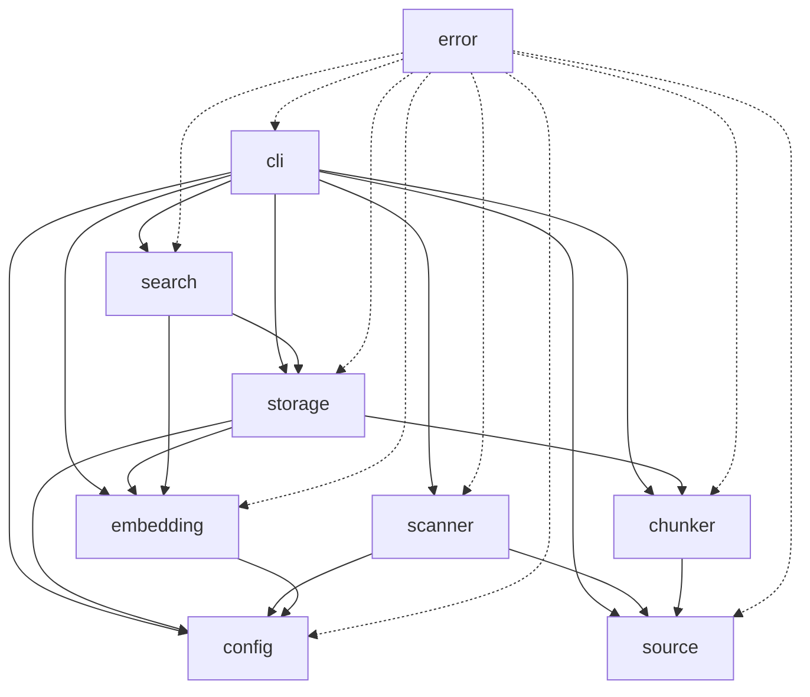

# Stage 1 Implementation Specification

## Overview

This document provides a detailed implementation specification for Stage 1 of the `sem` project - a local-first semantic search tool built in Rust with LanceDB as the default backend.

**Stage 1 Scope:**
- Config system
- Source registry
- File scanning
- Ignore rules
- Basic chunking
- Local embeddings
- LanceDB adapter
- `index` command
- `search` command
- `--json` output flag

---

## 1. Project Structure

### 1.1 Directory Layout

```
sem/
├── Cargo.toml
├── Cargo.lock
├── .gitignore
├── README.md
├── LICENSE
├── docs/
│   ├── final-plan.md
│   ├── initial-plan.md
│   └── stage1-spec.md
└── src/
    ├── main.rs              # CLI entry point
    ├── lib.rs               # Library root
    ├── cli/
    │   ├── mod.rs
    │   ├── args.rs          # CLI argument definitions
    │   └── commands/
    │       ├── mod.rs
    │       ├── init.rs
    │       ├── source.rs
    │       ├── index.rs
    │       └── search.rs
    ├── config/
    │   ├── mod.rs
    │   ├── schema.rs        # Config struct definitions
    │   └── loader.rs        # Config file loading/saving
    ├── source/
    │   ├── mod.rs
    │   ├── registry.rs      # Source management
    │   └── types.rs         # Source-related types
    ├── scanner/
    │   ├── mod.rs
    │   ├── walker.rs        # File system traversal
    │   └── ignore.rs        # Ignore rule handling
    ├── chunker/
    │   ├── mod.rs
    │   ├── traits.rs        # Chunker trait
    │   ├── markdown.rs      # Markdown chunker
    │   └── code.rs          # Code file chunker
    ├── embedding/
    │   ├── mod.rs
    │   ├── traits.rs        # Embedder trait
    │   ├── models.rs        # Model definitions
    │   └── runtime.rs       # Embedding runtime adapter
    ├── storage/
    │   ├── mod.rs
    │   ├── bundle.rs        # Bundle management
    │   ├── lancedb.rs       # LanceDB adapter
    │   └── schema.rs        # Storage schemas
    ├── search/
    │   ├── mod.rs
    │   └── semantic.rs      # Semantic search implementation
    └── error.rs             # Error types
```

### 1.2 Storage Layout at Runtime

```
~/.sem/
├── config.toml              # Main configuration
├── bundles/
│   └── default/
│       ├── manifest.json    # Bundle metadata
│       ├── chunks.parquet   # Chunk data
│       ├── embeddings.parquet
│       └── model.json       # Model info
└── backends/
    └── lancedb/             # LanceDB data files
```

---

## 2. Crate/Module Layout

### 2.1 Module Dependency Graph



### 2.2 Module Responsibilities

| Module | Responsibility |
|--------|----------------|
| `cli` | CLI argument parsing, command dispatch |
| `config` | Configuration loading, validation, saving |
| `source` | Source registry management |
| `scanner` | File discovery and filtering |
| `chunker` | Text chunking strategies |
| `embedding` | Embedding model integration |
| `storage` | Bundle and backend storage |
| `search` | Search operations |
| `error` | Error types and handling |

### 2.3 src/lib.rs Structure

```rust
pub mod cli;
pub mod config;
pub mod source;
pub mod scanner;
pub mod chunker;
pub mod embedding;
pub mod storage;
pub mod search;
pub mod error;

pub use error::{Result, SemError};
pub use config::Config;
pub use source::SourceRegistry;
```

### 2.4 src/main.rs Structure

```rust
use clap::Parser;
use sem::cli::args::Cli;
use sem::cli::commands;
use sem::error::Result;

fn main() -> Result<()> {
    let cli = Cli::parse();
    
    match cli.command {
        Commands::Init(args) => commands::init::run(args),
        Commands::Source(source_cmd) => commands::source::dispatch(source_cmd),
        Commands::Index(args) => commands::index::run(args),
        Commands::Search(args) => commands::search::run(args),
    }
}
```

---

## 3. Config Schema

### 3.1 config.toml Structure

```toml
# ~/.sem/config.toml

[general]
default_bundle = "default"
embedding_mode = "balanced"  # light, balanced, quality, nomic

[embedding]
mode = "balanced"
model_cache_dir = "~/.sem/models"

[storage]
bundle_dir = "~/.sem/bundles"
backend = "lancedb"

[backend.lancedb]
path = "~/.sem/backends/lancedb"

[[sources]]
name = "vault"
path = "~/vault"
enabled = true

[sources.types]
include = ["md", "txt"]
exclude = []

[[sources]]
name = "repos"
path = "~/code"
enabled = true

[sources.types]
include = ["rs", "ts", "js", "py", "md"]
exclude = ["min.js", "min.css"]

[ignore]
default_patterns = [
    "node_modules",
    ".git",
    "__pycache__",
    "*.min.js",
    "*.min.css",
    "target",
    "dist",
    "build",
    ".obsidian",
    ".idea",
    ".vscode"
]

[chunking]
max_chunk_size = 512      # tokens
overlap = 50              # tokens
min_chunk_size = 100      # tokens
```

### 3.2 Config Rust Structures

```rust
// src/config/schema.rs

use serde::{Deserialize, Serialize};
use std::path::PathBuf;

#[derive(Debug, Clone, Serialize, Deserialize)]
pub struct Config {
    pub general: GeneralConfig,
    pub embedding: EmbeddingConfig,
    pub storage: StorageConfig,
    pub sources: Vec<SourceConfig>,
    pub ignore: IgnoreConfig,
    pub chunking: ChunkingConfig,
}

#[derive(Debug, Clone, Serialize, Deserialize)]
pub struct GeneralConfig {
    pub default_bundle: String,
    pub embedding_mode: EmbeddingMode,
}

#[derive(Debug, Clone, Serialize, Deserialize, Default)]
#[serde(rename_all = "lowercase")]
pub enum EmbeddingMode {
    Light,
    #[default]
    Balanced,
    Quality,
    Nomic,
}

#[derive(Debug, Clone, Serialize, Deserialize)]
pub struct EmbeddingConfig {
    #[serde(default)]
    pub mode: EmbeddingMode,
    pub model_cache_dir: PathBuf,
}

#[derive(Debug, Clone, Serialize, Deserialize)]
pub struct StorageConfig {
    pub bundle_dir: PathBuf,
    pub backend: BackendType,
}

#[derive(Debug, Clone, Serialize, Deserialize)]
#[serde(rename_all = "lowercase")]
pub enum BackendType {
    LanceDB,
}

#[derive(Debug, Clone, Serialize, Deserialize)]
pub struct SourceConfig {
    pub name: String,
    pub path: PathBuf,
    #[serde(default = "default_true")]
    pub enabled: bool,
    #[serde(default)]
    pub types: TypeFilter,
}

#[derive(Debug, Clone, Serialize, Deserialize, Default)]
pub struct TypeFilter {
    #[serde(default)]
    pub include: Vec<String>,
    #[serde(default)]
    pub exclude: Vec<String>,
}

#[derive(Debug, Clone, Serialize, Deserialize)]
pub struct IgnoreConfig {
    #[serde(default = "default_ignore_patterns")]
    pub default_patterns: Vec<String>,
}

fn default_ignore_patterns() -> Vec<String> {
    vec![
        "node_modules".to_string(),
        ".git".to_string(),
        "__pycache__".to_string(),
        "target".to_string(),
        "dist".to_string(),
        "build".to_string(),
        ".obsidian".to_string(),
    ]
}

#[derive(Debug, Clone, Serialize, Deserialize)]
pub struct ChunkingConfig {
    #[serde(default = "default_max_chunk_size")]
    pub max_chunk_size: usize,
    #[serde(default = "default_overlap")]
    pub overlap: usize,
    #[serde(default = "default_min_chunk_size")]
    pub min_chunk_size: usize,
}

fn default_max_chunk_size() -> usize { 512 }
fn default_overlap() -> usize { 50 }
fn default_min_chunk_size() -> usize { 100 }
fn default_true() -> bool { true }
```

---

## 4. Data Structures

### 4.1 Source Definition

```rust
// src/source/types.rs

use serde::{Deserialize, Serialize};
use std::path::PathBuf;
use uuid::Uuid;

#[derive(Debug, Clone, Serialize, Deserialize)]
pub struct Source {
    pub id: SourceId,
    pub name: String,
    pub path: PathBuf,
    pub enabled: bool,
    pub file_types: FileTypes,
    pub created_at: chrono::DateTime<chrono::Utc>,
    pub updated_at: chrono::DateTime<chrono::Utc>,
}

#[derive(Debug, Clone, Serialize, Deserialize)]
pub struct SourceId(pub Uuid);

impl SourceId {
    pub fn new() -> Self {
        Self(Uuid::new_v4())
    }
}

#[derive(Debug, Clone, Serialize, Deserialize, Default)]
pub struct FileTypes {
    pub include: Vec<String>,
    pub exclude: Vec<String>,
}

impl Source {
    pub fn new(name: String, path: PathBuf) -> Self {
        let now = chrono::Utc::now();
        Self {
            id: SourceId::new(),
            name,
            path,
            enabled: true,
            file_types: FileTypes::default(),
            created_at: now,
            updated_at: now,
        }
    }
}
```

### 4.2 Chunk with Metadata

```rust
// src/storage/schema.rs

use serde::{Deserialize, Serialize};
use std::path::PathBuf;
use uuid::Uuid;

#[derive(Debug, Clone, Serialize, Deserialize)]
pub struct Chunk {
    pub id: ChunkId,
    pub source_id: SourceId,
    pub file_path: PathBuf,
    pub content: String,
    pub start_line: usize,
    pub end_line: usize,
    pub chunk_index: usize,
    pub metadata: ChunkMetadata,
    pub created_at: chrono::DateTime<chrono::Utc>,
}

#[derive(Debug, Clone, Serialize, Deserialize)]
pub struct ChunkId(pub Uuid);

impl ChunkId {
    pub fn new() -> Self {
        Self(Uuid::new_v4())
    }
}

#[derive(Debug, Clone, Serialize, Deserialize)]
pub struct ChunkMetadata {
    pub file_type: FileType,
    pub title: Option<String>,
    pub headings: Vec<String>,
    pub language: Option<String>,
    pub checksum: String,  // Content hash for dedup
}

#[derive(Debug, Clone, Serialize, Deserialize)]
pub enum FileType {
    Markdown,
    Code,
    Text,
    Unknown,
}

impl FileType {
    pub fn from_extension(ext: &str) -> Self {
        match ext.to_lowercase().as_str() {
            "md" | "markdown" => FileType::Markdown,
            "rs" | "ts" | "js" | "py" | "go" | "java" | "c" | "cpp" => FileType::Code,
            "txt" => FileType::Text,
            _ => FileType::Unknown,
        }
    }
}
```

### 4.3 Embedding Model Config

```rust
// src/embedding/models.rs

use serde::{Deserialize, Serialize);

#[derive(Debug, Clone, Serialize, Deserialize)]
pub struct EmbeddingModel {
    pub name: String,
    pub mode: EmbeddingMode,
    pub dimension: usize,
    pub max_tokens: usize,
    pub huggingface_id: String,
}

#[derive(Debug, Clone, Copy, Serialize, Deserialize, Default)]
#[serde(rename_all = "lowercase")]
pub enum EmbeddingMode {
    Light,
    #[default]
    Balanced,
    Quality,
    Nomic,
}

impl EmbeddingMode {
    pub fn model(&self) -> EmbeddingModel {
        match self {
            EmbeddingMode::Light => EmbeddingModel {
                name: "all-MiniLM-L6-v2".to_string(),
                mode: *self,
                dimension: 384,
                max_tokens: 256,
                huggingface_id: "sentence-transformers/all-MiniLM-L6-v2".to_string(),
            },
            EmbeddingMode::Balanced => EmbeddingModel {
                name: "bge-small-en-v1.5".to_string(),
                mode: *self,
                dimension: 384,
                max_tokens: 512,
                huggingface_id: "BAAI/bge-small-en-v1.5".to_string(),
            },
            EmbeddingMode::Quality => EmbeddingModel {
                name: "bge-base-en-v1.5".to_string(),
                mode: *self,
                dimension: 768,
                max_tokens: 512,
                huggingface_id: "BAAI/bge-base-en-v1.5".to_string(),
            },
            EmbeddingMode::Nomic => EmbeddingModel {
                name: "nomic-embed-text".to_string(),
                mode: *self,
                dimension: 768,
                max_tokens: 8192,
                huggingface_id: "nomic-ai/nomic-embed-text-v1".to_string(),
            },
        }
    }
}

#[derive(Debug, Clone, Serialize, Deserialize)]
pub struct EmbeddingVector(pub Vec<f32>);

#[derive(Debug, Clone, Serialize, Deserialize)]
pub struct EmbeddingRecord {
    pub chunk_id: ChunkId,
    pub vector: EmbeddingVector,
    pub model_name: String,
    pub created_at: chrono::DateTime<chrono::Utc>,
}
```

### 4.4 Search Results

```rust
// src/search/mod.rs

use serde::{Deserialize, Serialize};
use std::path::PathBuf;

#[derive(Debug, Clone, Serialize, Deserialize)]
pub struct SearchResult {
    pub chunk_id: String,
    pub file_path: PathBuf,
    pub snippet: String,
    pub score: f32,
    pub source_name: String,
    pub metadata: ResultMetadata,
}

#[derive(Debug, Clone, Serialize, Deserialize)]
pub struct ResultMetadata {
    pub file_type: String,
    pub title: Option<String>,
    pub language: Option<String>,
    pub start_line: usize,
    pub end_line: usize,
}

#[derive(Debug, Clone, Serialize, Deserialize)]
pub struct SearchResults {
    pub query: String,
    pub results: Vec<SearchResult>,
    pub total: usize,
    pub mode: SearchMode,
    pub elapsed_ms: u64,
}

#[derive(Debug, Clone, Serialize, Deserialize)]
#[serde(rename_all = "lowercase")]
pub enum SearchMode {
    Semantic,
}

impl SearchResults {
    pub fn to_json(&self) -> Result<String> {
        serde_json::to_string_pretty(self)
            .map_err(|e| SemError::Serialization(e.to_string()))
    }
}
```

---

## 5. CLI Command Specifications

### 5.1 Command Overview

```rust
// src/cli/args.rs

use clap::{Parser, Subcommand};

#[derive(Parser)]
#[command(name = "sem")]
#[command(about = "Local-first semantic search for repos and notes", long_about = None)]
pub struct Cli {
    #[command(subcommand)]
    pub command: Commands,
}

#[derive(Subcommand)]
pub enum Commands {
    /// Initialize sem configuration
    Init(InitArgs),
    
    /// Manage sources
    #[command(subcommand)]
    Source(SourceCommands),
    
    /// Index all sources
    Index(IndexArgs),
    
    /// Search indexed content
    Search(SearchArgs),
}

#[derive(Args)]
pub struct InitArgs {
    /// Force reinitialize existing config
    #[arg(short, long)]
    pub force: bool,
}

#[derive(Subcommand)]
pub enum SourceCommands {
    /// Add a new source
    Add(SourceAddArgs),
    
    /// List all sources
    List,
    
    /// Remove a source by name
    Remove(SourceRemoveArgs),
}

#[derive(Args)]
pub struct SourceAddArgs {
    /// Path to the source directory
    pub path: String,
    
    /// Name for the source (defaults to directory name)
    #[arg(short, long)]
    pub name: Option<String>,
}

#[derive(Args)]
pub struct SourceRemoveArgs {
    /// Name of the source to remove
    pub name: String,
}

#[derive(Args)]
pub struct IndexArgs {
    /// Reindex from scratch (ignore existing index)
    #[arg(short, long)]
    pub full: bool,
    
    /// Specific source to index (indexes all if not specified)
    #[arg(short, long)]
    pub source: Option<String>,
}

#[derive(Args)]
pub struct SearchArgs {
    /// Search query
    pub query: String,
    
    /// Output as JSON
    #[arg(long)]
    pub json: bool,
    
    /// Maximum number of results
    #[arg(short = 'n', long, default_value = "10")]
    pub limit: usize,
    
    /// Filter by source name
    #[arg(short, long)]
    pub source: Option<String>,
}
```

### 5.2 Command Behaviors

#### `sem init`

**Purpose:** Initialize the sem configuration and storage structure.

**Behavior:**
1. Check if `~/.sem` directory exists
2. If exists and not `--force`, exit with message "Already initialized. Use --force to reinitialize."
3. Create directory structure:
   - `~/.sem/`
   - `~/.sem/bundles/default/`
   - `~/.sem/backends/lancedb/`
4. Create default `config.toml` with balanced embedding mode
5. Create empty `manifest.json` in default bundle
6. Print success message with config location

**Output:**
```
✓ Initialized sem at ~/.sem
✓ Config: ~/.sem/config.toml
✓ Default bundle: ~/.sem/bundles/default
✓ Backend: LanceDB at ~/.sem/backends/lancedb
```

**Exit Codes:**
- 0: Success
- 1: Already initialized (without --force)
- 2: Permission error

---

#### `sem source add <path>`

**Purpose:** Register a new source directory for indexing.

**Behavior:**
1. Resolve path to absolute path
2. Verify path exists and is a directory
3. If `--name` not provided, use directory name as source name
4. Check for duplicate source name
5. Add source to config.toml
6. Print confirmation

**Output:**
```
✓ Added source 'vault'
  Path: /Users/you/vault
  Run 'sem index' to index this source
```

**Exit Codes:**
- 0: Success
- 1: Path does not exist
- 2: Source name already exists
- 3: Config not initialized

---

#### `sem source list`

**Purpose:** Display all registered sources.

**Output:**
```
Sources:
  1. vault
     Path: /Users/you/vault
     Status: enabled
     
  2. repos
     Path: /Users/you/code
     Status: enabled
```

**Exit Codes:**
- 0: Success
- 1: No sources configured

---

#### `sem source remove <name>`

**Purpose:** Remove a source from the registry.

**Behavior:**
1. Find source by name
2. Remove from config.toml
3. Optionally prompt to remove indexed data for this source

**Output:**
```
✓ Removed source 'old-project'
```

**Exit Codes:**
- 0: Success
- 1: Source not found

---

#### `sem index`

**Purpose:** Index all enabled sources.

**Behavior:**
1. Load config and source registry
2. For each enabled source:
   a. Scan directory for files
   b. Apply ignore rules
   c. Filter by file type
   d. For each file:
      - Read content
      - Chunk content
      - Generate embeddings
      - Store in bundle and LanceDB
3. Update manifest with index metadata
4. Print summary

**Output:**
```
Indexing sources...

  vault:
    Files scanned: 234
    Chunks created: 1,456
    Embeddings: 1,456
    
  repos:
    Files scanned: 892
    Chunks created: 4,231
    Embeddings: 4,231

✓ Index complete
  Total chunks: 5,687
  Total embeddings: 5,687
  Time: 45.2s
```

**Exit Codes:**
- 0: Success
- 1: No sources configured
- 2: Embedding model error
- 3: Storage error

---

#### `sem search "<query>"`

**Purpose:** Search indexed content semantically.

**Behavior:**
1. Generate embedding for query
2. Search LanceDB for similar vectors
3. Retrieve chunk content and metadata
4. Format and display results

**Output (human-readable):**
```
Results for: "jwt auth flow"

1. ~/code/api/src/middleware/auth.ts (score: 0.91)
   ─────────────────────────────────────
   JWT validation happens before role checks.
   The middleware extracts the token from the
   Authorization header and verifies the signature...
   
2. ~/vault/security-notes.md (score: 0.87)
   ─────────────────────────────────────
   # Authentication Flow
   The JWT auth flow consists of three main
   steps: token generation, validation, and
   refresh...
```

**Output (--json):**
```json
{
  "query": "jwt auth flow",
  "results": [
    {
      "chunk_id": "uuid-here",
      "file_path": "/Users/you/code/api/src/middleware/auth.ts",
      "snippet": "JWT validation happens before role checks...",
      "score": 0.91,
      "source_name": "repos",
      "metadata": {
        "file_type": "code",
        "title": null,
        "language": "typescript",
        "start_line": 15,
        "end_line": 42
      }
    }
  ],
  "total": 2,
  "mode": "semantic",
  "elapsed_ms": 127
}
```

**Exit Codes:**
- 0: Success with results
- 0: Success with no results (empty results array)
- 1: Index not found
- 2: Embedding error

---

## 6. Dependencies

### 6.1 Core Dependencies

```toml
# Cargo.toml

[package]
name = "sem"
version = "0.1.0"
edition = "2021"
rust-version = "1.70"

[dependencies]
# CLI
clap = { version = "4.4", features = ["derive"] }

# Serialization
serde = { version = "1.0", features = ["derive"] }
serde_json = "1.0"
toml = "0.8"

# Async runtime
tokio = { version = "1.34", features = ["full"] }

# Storage
lancedb = "0.4"
arrow = "50.0"
parquet = "50.0"

# Embeddings (via ONNX Runtime)
ort = { version = "2.0", features = ["load-dynamic"] }
ndarray = "0.15"
tokenizers = "0.15"

# File handling
walkdir = "2.4"
glob = "0.3"
ignore = "0.4"  # For .gitignore support

# Utilities
uuid = { version = "1.6", features = ["v4", "serde"] }
chrono = { version = "0.4", features = ["serde"] }
sha2 = "0.10"
anyhow = "1.0"
thiserror = "1.0"
tracing = "0.1"
tracing-subscriber = "0.3"
dirs = "5.0"  # Home directory resolution

[dev-dependencies]
tempfile = "3.8"
assert_cmd = "2.0"
predicates = "3.0"
```

### 6.2 Dependency Rationale

| Crate | Purpose |
|-------|---------|
| `clap` | CLI argument parsing with derive macros |
| `serde` | Serialization for config and data structures |
| `toml` | Config file format |
| `tokio` | Async runtime for embedding and I/O |
| `lancedb` | Vector database storage |
| `arrow/parquet` | Columnar data format for bundles |
| `ort` | ONNX Runtime for running embedding models |
| `tokenizers` | HuggingFace tokenizers for text processing |
| `walkdir` | Directory traversal |
| `ignore` | gitignore-style pattern matching |
| `uuid` | Unique identifiers for chunks and sources |
| `chrono` | Timestamps |
| `sha2` | Content hashing for deduplication |
| `thiserror` | Custom error types |
| `tracing` | Logging and diagnostics |
| `dirs` | Cross-platform home directory |

---

## 7. Implementation Order

### Phase 1: Foundation (Days 1-2)

1. **Project Setup**
   - Initialize Cargo project
   - Set up module structure
   - Add base dependencies
   - Create error types

2. **Config System**
   - Define config schema
   - Implement config loader
   - Implement config saver
   - Add default config generation

3. **CLI Framework**
   - Set up clap structure
   - Implement `sem init` command
   - Add basic error handling

### Phase 2: Source Management (Day 3)

4. **Source Registry**
   - Define Source types
   - Implement source CRUD operations
   - Implement `sem source add`
   - Implement `sem source list`
   - Implement `sem source remove`

### Phase 3: File Processing (Days 4-5)

5. **File Scanner**
   - Implement directory walker
   - Add ignore rule matching
   - Implement file type filtering
   - Add file content reading

6. **Chunking**
   - Define Chunker trait
   - Implement Markdown chunker
   - Implement Code chunker
   - Add chunk metadata extraction

### Phase 4: Embeddings (Days 6-8)

7. **Embedding Runtime**
   - Set up ONNX Runtime integration
   - Implement model downloading
   - Create embedding inference pipeline
   - Add tokenizer integration

8. **Model Management**
   - Implement model caching
   - Add model selection by mode
   - Handle model initialization

### Phase 5: Storage (Days 9-10)

9. **Bundle Storage**
   - Implement Parquet writing
   - Implement Parquet reading
   - Create manifest management

10. **LanceDB Integration**
    - Set up LanceDB connection
    - Implement schema creation
    - Implement vector insertion
    - Implement vector search

### Phase 6: Indexing (Day 11)

11. **Index Command**
    - Wire up scanning → chunking → embedding → storage
    - Add progress reporting
    - Handle errors gracefully
    - Implement `--full` flag

### Phase 7: Search (Day 12)

12. **Search Command**
    - Implement query embedding
    - Implement vector search
    - Format human-readable output
    - Implement `--json` output

### Phase 8: Polish (Days 13-14)

13. **Testing & Documentation**
    - Add unit tests
    - Add integration tests
    - Write README
    - Add usage examples

---

## 8. Error Handling Strategy

### 8.1 Error Type Hierarchy

```rust
// src/error.rs

use thiserror::Error;

#[derive(Debug, Error)]
pub enum SemError {
    // Configuration errors
    #[error("Configuration not initialized. Run 'sem init' first.")]
    NotInitialized,
    
    #[error("Configuration file error: {0}")]
    ConfigFile(String),
    
    #[error("Invalid configuration: {0}")]
    ConfigInvalid(String),
    
    // Source errors
    #[error("Source not found: {0}")]
    SourceNotFound(String),
    
    #[error("Source already exists: {0}")]
    SourceExists(String),
    
    #[error("Source path does not exist: {0}")]
    SourcePathInvalid(String),
    
    // Indexing errors
    #[error("No sources configured. Add sources with 'sem source add'")]
    NoSources,
    
    #[error("File scan error: {0}")]
    ScanError(String),
    
    #[error("Chunking error for file {file}: {message}")]
    ChunkingError { file: String, message: String },
    
    // Embedding errors
    #[error("Embedding model not found: {0}")]
    ModelNotFound(String),
    
    #[error("Embedding inference failed: {0}")]
    EmbeddingInference(String),
    
    #[error("Model download failed: {0}")]
    ModelDownload(String),
    
    // Storage errors
    #[error("Storage error: {0}")]
    Storage(String),
    
    #[error("Database error: {0}")]
    Database(String),
    
    // Search errors
    #[error("Search error: {0}")]
    Search(String),
    
    #[error("Index not found. Run 'sem index' first.")]
    IndexNotFound,
    
    // I/O errors
    #[error("I/O error: {0}")]
    Io(#[from] std::io::Error),
    
    // Serialization errors
    #[error("Serialization error: {0}")]
    Serialization(String),
}

pub type Result<T> = std::result::Result<T, SemError>;
```

### 8.2 Error Propagation Pattern

```rust
// Example usage in commands
pub fn run(args: IndexArgs) -> Result<()> {
    let config = Config::load()
        .map_err(|e| {
            if matches!(e, SemError::Io(_)) {
                SemError::NotInitialized
            } else {
                e
            }
        })?;
    
    let sources = SourceRegistry::from_config(&config)?;
    
    if sources.is_empty() {
        return Err(SemError::NoSources);
    }
    
    // ... continue with indexing
    Ok(())
}
```

### 8.3 User-Facing Error Messages

All errors should:
1. Be clear and actionable
2. Suggest next steps when possible
3. Not expose internal implementation details
4. Use consistent formatting

Example:
```
Error: Source path does not exist: /path/to/missing

  The specified path could not be found. Please verify:
  - The path is correct
  - The directory exists
  - You have read permissions

  Run 'sem source list' to see configured sources.
```

---

## 9. Embedding Strategy

### 9.1 Architecture Overview


### 9.2 ONNX Runtime Integration

The embedding system uses ONNX Runtime to run sentence-transformer models locally. This approach:

1. **Downloads models once** - Models are cached in `~/.sem/models/`
2. **Runs inference locally** - No API calls, works offline
3. **Supports all embedding modes** - Same code path for all models

### 9.3 Embedder Trait

```rust
// src/embedding/traits.rs

use async_trait::async_trait;
use crate::error::Result;
use super::{EmbeddingVector, EmbeddingModel};

#[async_trait]
pub trait Embedder: Send + Sync {
    /// Get the model configuration
    fn model(&self) -> &EmbeddingModel;
    
    /// Generate embedding for a single text
    async fn embed(&self, text: &str) -> Result<EmbeddingVector>;
    
    /// Generate embeddings for multiple texts (batched)
    async fn embed_batch(&self, texts: &[String]) -> Result<Vec<EmbeddingVector>>;
    
    /// Check if the model is loaded
    fn is_loaded(&self) -> bool;
    
    /// Load the model (downloads if necessary)
    async fn load(&mut self) -> Result<()>;
}
```

### 9.4 ONNX Embedder Implementation

```rust
// src/embedding/runtime.rs

use ort::{Session, GraphOptimizationLevel};
use tokenizers::Tokenizer;
use ndarray::{Array1, Axis};
use async_trait::async_trait;
use std::path::PathBuf;

pub struct OnnxEmbedder {
    model: EmbeddingModel,
    session: Option<Session>,
    tokenizer: Option<Tokenizer>,
    model_dir: PathBuf,
}

impl OnnxEmbedder {
    pub fn new(model: EmbeddingModel, cache_dir: PathBuf) -> Self {
        Self {
            model,
            session: None,
            tokenizer: None,
            model_dir: cache_dir,
        }
    }
    
    fn model_path(&self) -> PathBuf {
        self.model_dir.join(&self.model.name)
    }
    
    async fn download_model(&self) -> Result<PathBuf> {
        // Download model.onnx and tokenizer.json from HuggingFace
        // Cache in model_dir
        todo!("Implement model download from HuggingFace")
    }
}

#[async_trait]
impl Embedder for OnnxEmbedder {
    fn model(&self) -> &EmbeddingModel {
        &self.model
    }
    
    async fn embed(&self, text: &str) -> Result<EmbeddingVector> {
        let tokenizer = self.tokenizer.as_ref()
            .ok_or(SemError::EmbeddingInference("Tokenizer not loaded".into()))?;
        
        let session = self.session.as_ref()
            .ok_or(SemError::EmbeddingInference("Model not loaded".into()))?;
        
        // Tokenize
        let encoded = tokenizer.encode(text, true)
            .map_err(|e| SemError::EmbeddingInference(e.to_string()))?;
        
        let input_ids: Vec<i64> = encoded.get_ids().iter().map(|&id| id as i64).collect();
        let attention_mask: Vec<i64> = encoded.get_attention_mask().iter().map(|&m| m as i64).collect();
        
        // Create input tensors
        let input_ids_array = Array1::from_vec(input_ids).insert_axis(Axis(0));
        let attention_mask_array = Array1::from_vec(attention_mask).insert_axis(Axis(0));
        
        // Run inference
        let outputs = session.run(ort::inputs![
            "input_ids" => input_ids_array.view(),
            "attention_mask" => attention_mask_array.view(),
        ]?).map_err(|e| SemError::EmbeddingInference(e.to_string()))?;
        
        // Extract and normalize embedding
        let embedding = outputs["last_hidden_state"]
            .try_extract_tensor::<f32>()
            .map_err(|e| SemError::EmbeddingInference(e.to_string()))?;
        
        // Mean pooling
        let pooled = mean_pool(embedding, &attention_mask);
        
        // Normalize
        let normalized = l2_normalize(&pooled);
        
        Ok(EmbeddingVector(normalized.to_vec()))
    }
    
    async fn embed_batch(&self, texts: &[String]) -> Result<Vec<EmbeddingVector>> {
        let mut results = Vec::with_capacity(texts.len());
        for text in texts {
            results.push(self.embed(text).await?);
        }
        Ok(results)
    }
    
    fn is_loaded(&self) -> bool {
        self.session.is_some() && self.tokenizer.is_some()
    }
    
    async fn load(&mut self) -> Result<()> {
        let model_path = self.download_model().await?;
        
        self.session = Some(
            Session::builder()
                .map_err(|e| SemError::EmbeddingInference(e.to_string()))?
                .with_optimization_level(GraphOptimizationLevel::Level3)
                .map_err(|e| SemError::EmbeddingInference(e.to_string()))?
                .commit_from_file(model_path.join("model.onnx"))
                .map_err(|e| SemError::EmbeddingInference(e.to_string()))?
        );
        
        self.tokenizer = Some(
            Tokenizer::from_file(model_path.join("tokenizer.json"))
                .map_err(|e| SemError::EmbeddingInference(e.to_string()))?
        );
        
        Ok(())
    }
}

fn mean_pool(embedding: &ndarray::ArrayView3<f32>, attention_mask: &[i64]) -> Array1<f32> {
    // Implement mean pooling over tokens, weighted by attention mask
    todo!("Implement mean pooling")
}

fn l2_normalize(vector: &Array1<f32>) -> Array1<f32> {
    let norm = (vector.mapv(|x| x * x).sum() as f32).sqrt();
    vector.mapv(|x| x / norm)
}
```

### 9.5 Model Download Strategy

Models are downloaded from HuggingFace on first use:

1. Check if model exists in `~/.sem/models/<model-name>/`
2. If not, download:
   - `model.onnx` (quantized ONNX model)
   - `tokenizer.json` (HuggingFace tokenizer)
   - `config.json` (model configuration)
3. Store in cache directory
4. Subsequent runs use cached model

### 9.6 Alternative: Candle Integration

As an alternative to ONNX Runtime, consider using HuggingFace's Candle framework:

```toml
candle-core = "0.3"
candle-nn = "0.3"
candle-transformers = "0.3"
```

Candle is a pure Rust ML framework that may offer:
- Simpler dependency management
- Better Rust integration
- Smaller binary size

However, ONNX Runtime currently has better model compatibility and performance.

---

## 10. Testing Strategy

### 10.1 Unit Tests

Each module should have unit tests:

```rust
#[cfg(test)]
mod tests {
    use super::*;
    
    #[test]
    fn test_chunk_creation() {
        let chunk = Chunk::new(
            SourceId::new(),
            PathBuf::from("/test/file.md"),
            "Test content".to_string(),
            1,
            10,
            0,
        );
        
        assert_eq!(chunk.content, "Test content");
        assert_eq!(chunk.start_line, 1);
    }
}
```

### 10.2 Integration Tests

```rust
// tests/integration_test.rs

use assert_cmd::Command;
use predicates::prelude::*;

#[test]
fn test_init_command() {
    let mut cmd = Command::cargo_bin("sem").unwrap();
    cmd.arg("init")
        .assert()
        .success()
        .stdout(predicate::str::contains("Initialized sem"));
}

#[test]
fn test_source_add_and_list() {
    let mut cmd = Command::cargo_bin("sem").unwrap();
    cmd.arg("source")
        .arg("add")
        .arg("/tmp/test-source")
        .assert()
        .success();
    
    let mut cmd = Command::cargo_bin("sem").unwrap();
    cmd.arg("source")
        .arg("list")
        .assert()
        .success()
        .stdout(predicate::str::contains("test-source"));
}
```

---

## 11. Future Considerations

### 11.1 Stage 2 Preparation

The Stage 1 architecture should support future additions:

- **Incremental indexing**: Content hashing is already in place
- **Sync command**: Can reuse scanning and chunking logic
- **Watch mode**: Scanner can be adapted for file watching

### 11.2 Backend Abstraction

The storage layer should define a trait for backends:

```rust
pub trait VectorBackend: Send + Sync {
    async fn insert(&self, chunks: &[ChunkWithEmbedding]) -> Result<()>;
    async fn search(&self, query: &EmbeddingVector, k: usize) -> Result<Vec<SearchResult>>;
    async fn delete_by_source(&self, source_id: &SourceId) -> Result<()>;
}
```

This allows future support for Qdrant and Meilisearch.

---

## 12. Summary

This specification provides a complete blueprint for implementing Stage 1 of the `sem` project. Key decisions:

1. **Rust with clap** for a fast, native CLI
2. **LanceDB** for local vector storage
3. **ONNX Runtime** for local embedding inference
4. **Parquet/Arrow** for portable bundle storage
5. **Modular architecture** with clear separation of concerns

The implementation should follow the order specified in Section 7, starting with the foundation (config, CLI) and building up to the full indexing and search pipeline.
