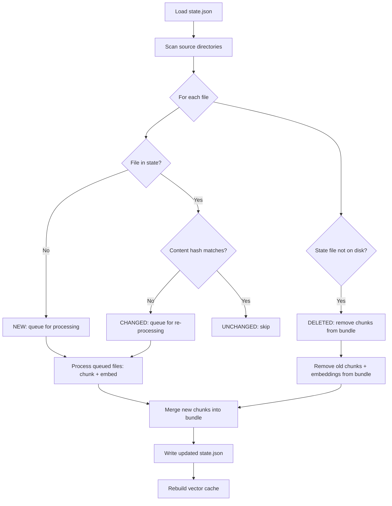
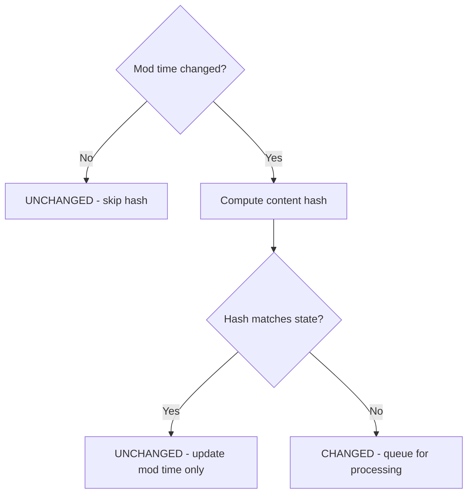
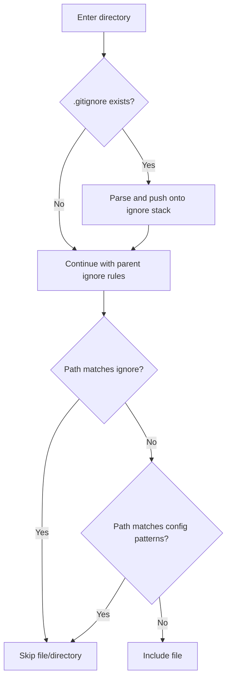
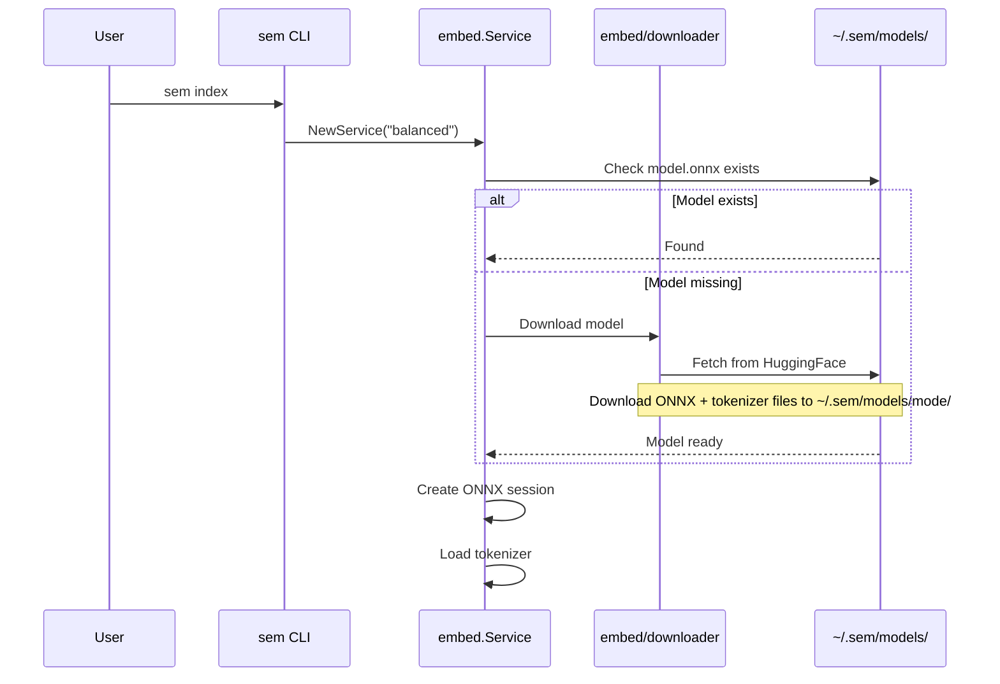

# Phase 2: Practical Daily Use — Technical Spec

## 1. Executive Summary

Phase 2 transforms `sem` from a proof-of-concept that does full rebuilds with fake embeddings into a practical daily tool that incrementally syncs only changed files and uses real neural embeddings via ONNX Runtime.

The three big shifts:

1. **Incremental sync** — detect changed/new/deleted files, only re-process what moved. Store file state in a `state.json` alongside the bundle. Merge changes into existing Parquet data instead of full overwrite.
2. **Real ONNX embeddings** — replace the hash-based placeholder with actual model inference using `yalue/onnxruntime_go`. Download models from HuggingFace on first use. Batch embedding for memory efficiency on M1/8GB.
3. **.gitignore support** — parse real `.gitignore` files during scanning using `sabhiram/go-gitignore`, with proper nested handling and precedence over config patterns.

Additionally: fix the `--source` overwrite bug, add `sem sync` and `sem status` commands.

This approach fits the current stage because Phase 1 already has deterministic chunk IDs and content hashing — the foundation for incremental sync is already in place. The embedding service interface is clean enough to swap implementations without changing callers.

---

## 2. Inputs and Context

### PRD referenced
- `docs/final-plan.md` — Stage 2 scope: "incremental sync, deterministic IDs, content hashing, snippets, .gitignore support, default skip rules"
- `plans/phase-1.md` — Phase 1 reference document

### Already complete (no work needed)
- Deterministic chunk IDs: `SHA1(sourceName|relPath|chunkIndex|SHA1(fileContent))`
- Content hashing: `SHA1(full file content)` on every `chunk.Record`
- Snippets in output: `output/format.go` already truncates
- Default skip rules: hardcoded in `config.Default()`

### Relevant codebase areas
- `internal/indexer/indexer.go` — full-rebuild pipeline, main target for incremental logic
- `internal/scan/walker.go` — hand-rolled ignore, needs .gitignore integration
- `internal/embed/service.go` — hash-based placeholder, needs ONNX replacement
- `internal/storage/bundle.go` — full-overwrite Parquet I/O, needs merge support
- `internal/storage/lancedb.go` — JSON cache, needs incremental rebuild
- `internal/cli/index.go` — `--full` flag ignored, `--source` overwrites bundle

### Existing architectural constraints
- Go 1.21+, module `sem`
- Bundle is canonical source of truth; cache is rebuildable
- M1/8GB target — memory-efficient batching required
- No Docker, no always-on services
- 4 embedding modes: light (384d), balanced (384d), quality (768d), nomic (768d)

### Assumptions
- ONNX Runtime shared library can be distributed or installed separately (CGO dependency)
- Models are small enough to download on first use (largest ~430MB for quality mode)
- Users accept a one-time model download prompt
- `state.json` in the bundle directory is sufficient for tracking file state (no external DB)

---

## 3. Goals

1. **Incremental indexing** — `sem index` only processes files that are new, changed, or deleted since last index
2. **Real semantic search** — replace hash-based embeddings with actual neural model inference
3. **.gitignore awareness** — scanner respects `.gitignore` files found in source directories
4. **Correct multi-source indexing** — `--source` merges into existing bundle instead of overwriting
5. **New commands** — `sem sync` (shorthand for incremental index), `sem status` (index health)
6. **Model management** — download and cache ONNX models on first use

---

## 4. Non-Goals

- **LanceDB integration** — still using JSON cache; real LanceDB is deferred to a later phase
- **File watching / `sem watch`** — deferred to Stage 6
- **Hybrid search / ripgrep** — deferred to Stage 3
- **TUI** — deferred to Stage 4
- **AI tool integration / MCP** — deferred to Stage 5
- **Bundle export/import** — deferred to Stage 7
- **Concurrent embedding** — batching yes, parallel workers no (keep it simple for now)

---

## 5. Proposed Architecture

### 5.1 Incremental Sync Engine

#### File State Tracking

A new `state.json` file in the bundle directory tracks per-file metadata across indexing runs:

```json
{
  "version": "1",
  "embedding_mode": "balanced",
  "chunking_hash": "sha1-of-chunking-config",
  "files": {
    "sourceName|relPath": {
      "content_hash": "sha1-of-file-content",
      "modified_at": "2026-04-07T10:30:00Z",
      "byte_size": 4200,
      "chunk_ids": ["abc123", "def456"]
    }
  }
}
```

Key: `sourceName|relPath` — uniquely identifies a file across sources.
Value: content hash + mod time + the chunk IDs that belong to this file.

**Why `state.json` instead of extending `manifest.json`?**
- Manifest is summary metadata (counts, timestamps, model info). State is operational data that changes every sync. Separating them keeps manifest clean and state easy to rewrite.
- State can grow large (one entry per indexed file). Keeping it separate avoids bloating the manifest.

#### Diff Algorithm



The diff is straightforward:
1. Load previous `state.json`
2. Scan all source directories (fast — just stat, don't read content yet)
3. For each file found:
   - If not in state → **new** → queue
   - If in state but content hash differs → **changed** → queue
   - If in state and hash matches → **unchanged** → skip
4. For each file in state not found on disk → **deleted** → mark for removal
5. Process only queued files (read content, chunk, embed)
6. Remove deleted file chunks from bundle
7. Merge new/changed chunks into bundle
8. Write updated state, rebuild vector cache

**Content hash comparison** is the primary change detector. Mod time is a fast-path optimization: if mod time hasn't changed, we can skip computing the hash entirely.



#### Bundle Merge Strategy

Instead of full overwrite, the bundle needs read-modify-write:

1. Load existing chunks and embeddings from Parquet
2. Build a set of chunk IDs to remove (deleted files + old versions of changed files)
3. Filter out removed chunks/embeddings
4. Append new chunks/embeddings
5. Write the merged result back to Parquet

This is O(n) in the total index size for each sync, which is acceptable for personal-scale use (<100k chunks). For larger scales, append-only Parquet with compaction would be better, but that's a later optimization.

#### `--full` Flag Behavior

- `sem index` (default): incremental sync — only process changed files
- `sem index --full`: full rebuild — re-process everything, reset state.json
- `sem sync`: alias for `sem index` (incremental by default)

#### `--source` Flag Fix

When `--source` is specified:
1. Load existing bundle (all sources)
2. Remove all chunks/embeddings belonging to the named source
3. Re-index only that source
4. Merge the new chunks back into the bundle
5. Other sources' data is preserved

This replaces the current behavior where `--source` overwrites the entire bundle.

### 5.2 .gitignore Support

#### Library: `sabhiram/go-gitignore`

Well-maintained, widely used, supports full `.gitignore` semantics including:
- Negation patterns (`!foo`)
- Directory-only patterns (`foo/`)
- Glob patterns (`*.log`, `build/**/temp`)
- Nested `.gitignore` files

#### Integration with Scanner



The scanner maintains a **stack of ignore matchers**:
- At the source root, check for `.gitignore` and parse it
- When entering a subdirectory, check for a nested `.gitignore` and push onto the stack
- When leaving a directory, pop the stack
- A path is ignored if **any** matcher in the stack matches it

#### Precedence Rules

1. `.gitignore` patterns (most specific first — nested files override parent)
2. Source-specific `exclude_patterns` from config
3. Global `default_patterns` from config

If a `.gitignore` says to ignore a file, config patterns cannot un-ignore it. This matches how git works — `.gitignore` is the source of truth for what's tracked.

#### Changes to `scan/walker.go`

- Replace the hand-rolled `matcher` struct with a `go-gitignore` based implementation
- Add `.gitignore` file detection and parsing during directory walk
- Keep config-based patterns as a secondary filter
- Remove the hardcoded hidden-directory skip (`.gitignore` handles `.git`; other dot-dirs should be respected if not ignored)

### 5.3 Real ONNX Embeddings

#### Library: `yalue/onnxruntime_go`

Go bindings for Microsoft's ONNX Runtime. Supports CPU execution (no GPU needed for our model sizes). Requires CGO and the ONNX Runtime shared library.

**Why this library:**
- Most mature Go ONNX Runtime binding
- Actively maintained
- Supports all execution providers (CPU, CUDA, CoreML)
- Works with the ONNX model format our HuggingFace models export to

#### Model Download and Caching



Model storage layout:
```
~/.sem/models/
  light/
    model.onnx           # ONNX model file
    tokenizer.json        # HuggingFace fast tokenizer
  balanced/
    model.onnx
    tokenizer.json
  quality/
    model.onnx
    tokenizer.json
  nomic/
    model.onnx
    tokenizer.json
```

**Download sources** — pre-exported ONNX models from HuggingFace:
- light: `sentence-transformers/all-MiniLM-L6-v2` → ONNX export
- balanced: `BAAI/bge-small-en-v1.5` → ONNX export
- quality: `BAAI/bge-base-en-v1.5` → ONNX export
- nomic: `nomic-ai/nomic-embed-text-v1` → ONNX export

We'll use pre-converted ONNX models from the `optimum` exports on HuggingFace where available, or bundle a conversion step.

**First-use prompt**: When a model mode is used for the first time and the ONNX file is missing, print a message like:
```
Downloading embedding model 'balanced' (bge-small-en-v1.5)...
This is a one-time download (~130MB).
```

#### Tokenizer Strategy

Use a lightweight Go tokenizer that reads HuggingFace `tokenizer.json` format. The tokenizer handles:
- BPE/WordPiece tokenization depending on model
- Special token insertion (CLS, SEP, padding)
- Truncation to `max_tokens`

The tokenizer JSON file is downloaded alongside the ONNX model.

#### Batching for M1/8GB

Embedding large document sets can exhaust memory. Strategy:

1. Process texts in batches of `config.Embedding.BatchSize` (default 32)
2. Each batch: tokenize all texts → pad to same length → run ONNX inference → extract [CLS] or mean-pooled output
3. Between batches, no need to release the ONNX session — keep it alive for the duration of indexing
4. Memory estimate for balanced mode: 32 texts × 512 tokens × 4 bytes (int32) ≈ 260KB input per batch. Model weights ~130MB in memory. Total well under 1GB.

#### Model Change Detection

If the user switches embedding mode (e.g., from `balanced` to `quality`):
- The new mode has a different dimension (384 → 768)
- All existing embeddings are invalid
- `state.json` records `embedding_mode` — if it differs from config, trigger a full rebuild
- Print: `Embedding mode changed from 'balanced' to 'quality'. Full rebuild required.`

Similarly, if chunking config changes (different `max_chars` or `overlap_chars`), chunk IDs change, so a full rebuild is needed. Track `chunking_hash` in state.json.

#### Service Interface Changes

The `embed.Service` interface stays the same:
```go
type Service struct { ... }
func NewService(mode string) (*Service, error)
func (s *Service) Model() ModelSpec
func (s *Service) EmbedDocuments(ctx context.Context, texts []string) ([][]float32, error)
func (s *Service) EmbedQuery(ctx context.Context, text string) ([]float32, error)
```

New additions:
```go
func (s *Service) Close() error  // Release ONNX session
func EnsureModel(mode string, modelCacheDir string) error  // Download if missing
```

The hash-based `embedText()` function is replaced with ONNX inference. The old hash implementation is removed entirely — no fallback mode.

### 5.4 New CLI Commands

#### `sem sync`

Shorthand for incremental indexing. Equivalent to `sem index` without `--full`.

```bash
sem sync              # Incremental sync all sources
sem sync --source X   # Incremental sync single source
```

Output:
```
Synced 3 sources: 12 new, 5 changed, 2 deleted files
Chunks: 1847 total (23 added, 8 removed)
Embedding mode: balanced (bge-small-en-v1.5)
```

#### `sem status`

Shows index health and staleness:

```bash
sem status
```

Output:
```
Bundle: default
Indexed: 2 hours ago (2026-04-07 10:30:00)
Model: balanced (bge-small-en-v1.5)
Sources: 2
  vault       142 files, 1847 chunks
  project-docs  38 files, 412 chunks
Total: 180 files, 2259 chunks, 2259 embeddings
State: up to date
```

If files have changed since last index:
```
State: stale (3 files changed, 1 new file since last index)
Run: sem sync
```

Implementation: compare current file mod times against `state.json` entries. If any file has a newer mod time, mark as stale.

---

## 6. Key Technical Decisions

### Decision 1: `state.json` for file tracking (not extending manifest)

**Why**: Manifest is summary metadata. State is per-file operational data that changes every sync. Separation keeps manifest small and clean, state easy to rewrite independently.

**Alternatives considered**:
- Extend manifest with file entries → bloats manifest, mixes concerns
- SQLite state database → adds dependency, overkill for <100k files
- Separate Parquet state file → harder to debug, JSON is inspectable

**Tradeoff**: `state.json` loads entirely into memory. At 100k files, this is ~10-15MB of JSON — fine for personal use. If scale grows beyond that, migrate to a more efficient format.

**Deferred**: Compaction or streaming state format for very large indexes.

### Decision 2: `sabhiram/go-gitignore` for .gitignore parsing

**Why**: Full gitignore semantics (negation, directory-only, nested). Well-tested. Avoids reimplementing a complex spec.

**Alternatives considered**:
- Hand-roll gitignore support → error-prone, gitignore spec has many edge cases
- `denormal/go-gitignore` → less maintained
- Use `git status --porcelain` → requires git repo, doesn't work for non-git directories

**Tradeoff**: Adds a dependency. The library hasn't seen a release in 2+ years but is stable and widely used.

**Deferred**: None — this is the right approach.

### Decision 3: `yalue/onnxruntime_go` for ONNX inference

**Why**: Most mature Go binding for ONNX Runtime. Supports CPU execution. Active maintenance.

**Alternatives considered**:
- `cdigu/onnxruntime_go` → fork of yalue, less maintained
- Call Python ONNX Runtime via subprocess → slow, requires Python
- Use ONNX Runtime C API directly via CGO → more work, same result
- Use `klauspost/go-onnxruntime` → mentioned in phase-1.md but appears less maintained than yalue

**Tradeoff**: Requires CGO and the ONNX Runtime shared library (`libonnxruntime.so` / `libonnxruntime.dylib`). Users must have ONNX Runtime installed or we bundle it. This is the biggest deployment complexity in Phase 2.

**Mitigation**: Provide clear install instructions. Consider bundling the shared library in the release binary or downloading it during `sem init`.

**Deferred**: GPU/CoreML acceleration — CPU is sufficient for our model sizes.

### Decision 4: Read-modify-write for bundle merge (not append-only)

**Why**: Simplest correct implementation. Read all chunks, filter out removed ones, append new ones, write back. O(n) but n is small for personal use.

**Alternatives considered**:
- Append-only Parquet with periodic compaction → more complex, harder to debug
- LanceDB as primary store → deferred to later phase
- Per-source Parquet files → complicates search (must query multiple files)

**Tradeoff**: Full rewrite of Parquet files on every sync. For 100k chunks this takes a few seconds — acceptable.

**Deferred**: Append-only with compaction for larger indexes.

### Decision 5: Mod-time fast path before content hash

**Why**: Computing SHA1 of every file is expensive. If mod time hasn't changed, the file content almost certainly hasn't changed. This makes the "no changes" sync path near-instant.

**Tradeoff**: Mod time can be faked (e.g., `touch` without content change). In that case we compute the hash and find it unchanged — small wasted work. The reverse (content changed but mod time unchanged) is extremely rare and would mean the file is skipped until its next real modification.

**Deferred**: None — this is standard practice (git does the same).

---

## 7. Simpler First Version

The minimum needed to ship Phase 2:

1. **State tracking** — `state.json` with per-file content hash and chunk IDs. No mod-time optimization yet — always compute hash. (Mod-time fast path is a small optimization added after the core works.)

2. **Incremental indexer** — diff against state, only process changed files, merge into bundle. `--full` flag forces complete rebuild.

3. **.gitignore** — parse root `.gitignore` only. Nested `.gitignore` support can wait — most repos have a root-level file that covers 90% of cases.

4. **ONNX embeddings** — `balanced` mode only at first. Get one model working end-to-end before adding the other three modes. Use `yalue/onnxruntime_go` with a simple tokenizer.

5. **`--source` fix** — merge instead of overwrite.

6. **`sem sync`** — thin wrapper around `indexer.Run()` with incremental mode.

7. **`sem status`** — read manifest + state, compare file mod times.

What stays explicit or manual:
- Model download: prompt on first use, no background downloading
- ONNX Runtime: user must install the shared library (documented in README)
- State format: JSON, no migration tooling yet
- No concurrent embedding — sequential batching only

---

## 8. Path to a More Solid Design

### Later improvements (Phase 3+)

1. **Mod-time fast path** — skip hash computation when mod time unchanged
2. **Nested .gitignore** — full recursive support during directory walk
3. **All 4 embedding modes** — light, quality, nomic after balanced works
4. **Concurrent embedding** — worker pool with `errgroup` for parallel batch processing
5. **Append-only Parquet** — avoid full rewrite on every sync, add compaction
6. **Real LanceDB** — replace JSON cache with actual LanceDB Go bindings
7. **Streaming state** — for indexes >100k files, stream state instead of loading all into memory
8. **Model bundling** — bundle ONNX Runtime shared library with releases
9. **Progress reporting** — progress bars for indexing and model download

### How the system evolves without major rework

- The `embed.Service` interface is stable — swapping implementations (hash → ONNX → future quantized) doesn't affect callers
- The `state.json` format is versioned — can add fields without breaking old state files
- The bundle Parquet schema is stable — adding columns is backward-compatible
- The scanner's ignore stack is extensible — can add more ignore sources (`.semignore`, global config) without restructuring

---

## 9. Codebase Impact

### New files

| File | Purpose |
|------|---------|
| `internal/indexer/state.go` | FileState type, Load/Save/Diff for state.json |
| `internal/indexer/sync.go` | Incremental sync logic (diff, merge, remove) |
| `internal/embed/onnx.go` | ONNX Runtime session management, inference |
| `internal/embed/tokenizer.go` | Tokenizer loading and text encoding |
| `internal/embed/download.go` | Model download from HuggingFace |
| `internal/cli/sync.go` | `sem sync` command |
| `internal/cli/status.go` | `sem status` command |

### Modified files

| File | Changes |
|------|---------|
| `internal/indexer/indexer.go` | Add incremental path, call state diff, merge results. Add `--full` support. Fix `--source` merge. |
| `internal/scan/walker.go` | Replace hand-rolled matcher with `go-gitignore`. Add `.gitignore` detection during walk. |
| `internal/embed/service.go` | Replace hash-based `embedText()` with ONNX inference. Add `Close()`. Add batching. |
| `internal/embed/model.go` | Add ONNX model URLs/filenames to `ModelSpec`. Add `ONNXFile` and `TokenizerFile` fields. |
| `internal/storage/bundle.go` | Add `Merge()` method for incremental updates. Add `RemoveChunks()` for deletions. |
| `internal/storage/lancedb.go` | Add `MergeRecords()` for incremental cache updates instead of full rebuild. |
| `internal/cli/root.go` | Register `sync` and `status` commands. |
| `internal/cli/index.go` | Wire `--full` flag. Pass to indexer. |
| `internal/errs/kinds.go` | Add `ErrModelNotFound`, `ErrModelDownload`, `ErrONNXRuntime`. |
| `internal/config/config.go` | Add `Gitignore` field to `IgnoreConfig` (bool, default true). |
| `internal/config/validate.go` | Remove "Stage 1" from backend validation message. |
| `go.mod` | Add `yalue/onnxruntime_go`, `sabhiram/go-gitignore`. |

### Deleted files

None. All Phase 1 code is preserved or evolved.

---

## 10. Risks and Failure Modes

### Risk 1: ONNX Runtime deployment complexity

**Scenario**: Users don't have ONNX Runtime installed. `sem index` fails with a cryptic CGO/library error.

**Mitigation**: 
- Clear error message: "ONNX Runtime not found. Install with: brew install onnxruntime / apt install libonnxruntime"
- Consider downloading the shared library during `sem init` or first model use
- Document prerequisites prominently in README

### Risk 2: Model download failures

**Scenario**: HuggingFace is down, network issues, download interrupted.

**Mitigation**:
- Download to a temp file first, rename on completion (atomic)
- Resume partial downloads
- Clear error message with manual download URL as fallback

### Risk 3: State.json corruption

**Scenario**: Process killed during sync, state.json partially written.

**Mitigation**:
- Write to `state.json.tmp` then rename (atomic on most filesystems)
- If state.json is missing or corrupt, fall back to full rebuild with a warning
- Version field allows future format migrations

### Risk 4: Large index memory usage

**Scenario**: 100k+ files, state.json is 15MB+, all chunks loaded into memory for merge.

**Mitigation**:
- For Phase 2, this is acceptable for personal use
- If it becomes a problem, switch to streaming Parquet read/write
- Document expected scale limits

### Risk 5: .gitignore edge cases

**Scenario**: Complex gitignore patterns (negation, nested, unicode paths) not handled correctly.

**Mitigation**:
- Use `sabhiram/go-gitignore` which handles the full spec
- Add test cases from git's own gitignore test suite
- Fall back gracefully — if gitignore parsing fails, log warning and continue without it

---

## 11. Validation Approach

### How to confirm the architecture is sound

1. **Incremental sync correctness**: After initial `sem index`, modify one file, run `sem sync`, verify only that file was re-processed. Delete a file, verify its chunks are removed. Add a file, verify it's indexed.

2. **ONNX embeddings quality**: Run `sem search` with real embeddings and verify results are semantically meaningful (not just keyword matches). Compare against the hash-based placeholder to confirm improvement.

3. **.gitignore**: Index a git repo, verify ignored files are excluded. Test with nested `.gitignore` files.

4. **--source merge**: Index two sources, then re-index one with `--source`, verify the other source's data is preserved.

5. **Model change**: Index with `balanced`, switch config to `quality`, run `sem index`, verify full rebuild is triggered.

### What should be tested first

1. State tracking: load/save/diff cycle
2. Bundle merge: remove chunks + append new ones
3. ONNX inference: single text embedding with balanced model
4. .gitignore: root-level file parsing

### Signs the design is too complex

- State tracking requires more than 3 files to implement
- Bundle merge logic exceeds 100 lines
- ONNX integration requires custom CGO bindings beyond what `yalue/onnxruntime_go` provides
- .gitignore integration requires rewriting the entire scanner

### Signs the design is insufficient

- Incremental sync is slower than full rebuild (defeats the purpose)
- Search quality doesn't improve with real embeddings (model/tokenizer issue)
- .gitignore misses files that git would ignore (incorrect semantics)

---

## 12. Implementation Guidance for Implementer

### Implementation order

1. **Add `go-gitignore` dependency and integrate into scanner** — self-contained change, no other package affected
2. **Add `state.json` tracking** — new `internal/indexer/state.go` with FileState, Load, Save, Diff types
3. **Add bundle merge support** — `storage.Bundle.Merge()` and `storage.Bundle.RemoveChunks()`
4. **Rewrite indexer for incremental sync** — modify `indexer.Run()` to use state diff, call merge instead of full write
5. **Fix `--source` and `--full` flags** — wire through CLI to indexer
6. **Add `sem sync` command** — thin wrapper, reuses indexer
7. **Add `sem status` command** — reads manifest + state
8. **Add ONNX Runtime dependency** — `go.mod` update, CGO setup
9. **Implement model download** — `internal/embed/download.go`
10. **Implement tokenizer** — `internal/embed/tokenizer.go`
11. **Replace hash-based embeddings with ONNX** — rewrite `internal/embed/service.go`
12. **Add model change detection** — compare state embedding_mode with config
13. **Test end-to-end** — full workflow: init → source add → index → modify file → sync → search
14. **Update documentation** — README, usage guide, phase-2 reference doc

### Key integration points

- `indexer.Run()` is the main integration point — it orchestrates scan, chunk, embed, and storage
- `embed.Service` interface is the boundary between indexing and embedding — keep it stable
- `storage.Bundle` is the boundary between indexer and persistence — add Merge/RemoveChunks there
- `scan.ScanSource` is the boundary between indexer and file system — add gitignore there

---

## 13. Open Questions

1. **ONNX Runtime distribution**: Should we bundle the shared library with releases, require users to install it, or download it automatically? **Recommended**: require install + document, auto-download later.

2. **Tokenizer library**: Is there a mature Go tokenizer for HuggingFace `tokenizer.json` format, or do we need to use a simpler tokenization approach? **Recommended**: evaluate `katanemo/pgtokenizer` and `bloomberg/go-tokenizer` during implementation; fall back to simple whitespace/BPE if needed.

3. **ONNX model source**: Should we use pre-exported ONNX models from HuggingFace (e.g., `optimum` exports) or export them ourselves? **Recommended**: use pre-exported where available, document export process for models that don't have ONNX exports.

---

## 14. Further Reading

### ONNX Runtime Go bindings
- [yalue/onnxruntime_go GitHub](https://github.com/yalue/onnxruntime_go) — the Go binding we'll use. Read the README for setup and basic usage.
- [ONNX Runtime docs](https://onnxruntime.ai/docs/) — official docs for understanding execution providers, session options, and performance tuning.

### HuggingFace Model Export to ONNX
- [Optimum ONNX export guide](https://huggingface.co/docs/optimum/exporters/onnx/overview) — how to export transformer models to ONNX format.
- [sentence-transformers ONNX](https://huggingface.co/sentence-transformers) — many models have pre-exported ONNX versions.

### .gitignore semantics
- [git gitignore docs](https://git-scm.com/docs/gitignore) — the full specification for `.gitignore` patterns.
- [sabhiram/go-gitignore](https://github.com/sabhiram/go-gitignore) — the Go library we'll use. Read the README for API and pattern support.

### Parquet in Go
- [parquet-go GitHub](https://github.com/parquet-go/parquet-go) — already in use. Useful for understanding merge/append patterns.

### Incremental indexing patterns
- [Meilisearch incremental updates](https://www.meilisearch.com/docs/learn/advanced/indexing) — good reference for how production search engines handle incremental updates.
- [SQLite FTS5 incremental](https://www.sqlite.org/fts5.html) — another reference for incremental index update patterns.